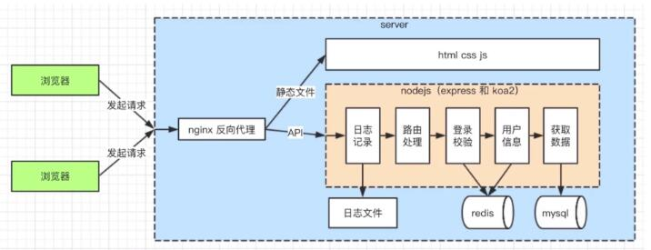

[TOC]

# Node.js搭建博客

## 开发接口（不用框架）

### http请求概述

- DNS 解析，建立 TCP 连接，发送 http 请求
- server 接收到 http 请求，处理并返回数据
- 客户端接收到返回数据，处理数据（例如渲染、执行JS）

### Node.js 处理http 请求

- get 请求和 querystring
- post 请求和 postdata
- 路由（接口、地址）

``` javascript
const http = require('http');
const server = http.createServer((req,res) => {
    res.end('hello world!');
});
server.listen(8000);
//浏览器访问 http://localhost:8000/
```

#### Node.js 处理 get 请求

- get  请求，客户端向 server 端获取数据，如查询博客列表
- 通过 querystring 来传递数据，如 a.html?a=100&b=200
- 浏览器直接访问，发送 get 请求

``` javascript
const http = require('http');
const querystring = require('querystring');
const server = http.createServer((req,res) => {
    console.log(req.method) //GET
    const url = req.url //获取请求的完整 URL
    //关键解析[0]是'?'前的内容, [1]是'?'后内容
    req.query = querystring.parse(url.split('?')[1]) 
    res.end(JSON.stringify(req.query)); //将 querystring 返回
});
server.listen(8000);
//浏览器访问 http://localhost:8000/
```

#### Node.js 处理 post 请求

- post 请求，即客户端要像服务端传递数据，如新建博客
- 通过 post data 传递数据，后面解释
- 浏览器无法直接模拟，需要手写JS，或者使用 postman app

``` javascript
const http = require('http')
const server = http.createServer((req, res) => {
    if (req.method === 'POST'){ 
        // POST 必须大写
        //数据格式
        console.log('content-type: ', req.headers['content-type'])
        //接收数据
        let postData = ''
        //开始接收数据
        req.on('data', chunk => {
			postData += chunk.toString()
        })
        //结束数据接收
        req.on('end'， () => {
            console.log('postData:', postData)
            res.end('hello world!') //在这里返回，因为是异步
        })
    }
})
server.listen(300)
```

#### Node.js 处理路由

- ` https://github.com/username/xxx ` 每个斜线后面的唯一标识就是路由

#### Node.js 综合应用

```javascript
const http = require('http')
const querystring = require('querystring')

const server = http.createServer((req, res) => {
    const method = req.method
    const url = req.url
    const path = url.split('?')[0] //重点：split('?'[0])语法弄清楚
    const query = querystring.parse(url.split('?')[1])

    //设置返回值格式为 JSON
    res.setHeader('Content-type', 'application/json')
    
    //返回的数据
    const resData = {
        method,
        url,
        path,
        query
    }
    
    //返回
    if (method === 'GET') {
        res.end(
            JSON.stringify(req.query)
        )
    }
    
    if (req.method === 'POST'){
        let postData = ''
        //res.on('data')指每次发送的数据
        //chunk 逐步接收数据 req绑定一个data方法 chunk是变量
        req.on('data', chunk => {
            postData += chunk.toString()
        })
        //req.on(end)数据发送完成；
        req.on('end', () => {
            console.log('postData:', postData)
            console.log('resData:', resData)
            resData.postData = postData
            //返回
            res.end(
                JSON.stringify(resData)
            )
        })
    }
})

server.listen(300)
console.log('OK')
```

### 搭建开发环境

- 从零搭建，不使用框架
- 使用 nodemon 监测文件变化，自动重启 node
- 使用 cross-env 设置环境变量，兼容Mac Linux 和 Windows
- 配置完后使用 ` $ npm run dev ` 命令启动项目

#### 开始搭建

**使用npm安装上述插件，设置npm镜像源**

1. 查看npm源地址
    `npm config list`

2. 结果:
    `metrics-registry = "http://registry.npm.taobao.org/"`

3. 修改registry地址，比如修改为淘宝镜像源。
    `npm set registry https://registry.npm.taobao.org/`
    如果有一天你肉身FQ到国外，用不上了，用rm命令删掉它
    `npm config rm registry`

4. ` npm install -g nodemon `
5. ` npm install -g cross-env `

**新建文件夹blog_1，在里面新建bin文件夹和app.js，在bin里面新建www.js文件**

``` javascript
// package.json 代码 注意： =不能有空格
{
  "name": "blog_1",
  "version": "1.0.0",
  "description": "",
  "main": "www.js",
  "scripts": {
    "test": "echo \"Error: no test specified\" && exit 1",
    "dev": "cross-env NODE_ENV=dev nodemon ./bin/www.js",
    "prd": "cross-env NODE_ENV=production nodemon ./bin/www.js"
  },
  "author": "",
  "license": "ISC"
}
```

```js
// ./bin/www.js 代码
const http = require('http')

const PORT = 300
const serverHandle = require('../app')
const server = http.createServer(serverHandle)
server.listen(PORT)
```

```js
// app.js 代码
const handleBlogRouter = require('./src/router/blog')
const handleUserRouter = require('./src/router/user')

const serverHandle = (req, res) => {
	//设置返回值格式 JSON
	res.setHeader('Content-type', 'application/json')

	// const resData = {
	// 	name: 'zhang',
	// 	site: 'imooc',
	// 	env: process.env.NODE_ENV
	// }

	// res.end(
	// 	JSON.stringify(resData)
	// )
	
	//处理 blog 路由
	const blogData = handleBlogRouter(req, res)
	if (blogData) {
		res.end(
			JSON.stringify(blogData)
		)
		return
	}
	//处理 user 路由
	const userData = handleUserRouter(req, res)
	if (userData) {
		res.end(
			JSON.stringify(userData)
		)
		return
	}
	//未命中路由，返回404
	res.writeHead(404, {"Content-type": "text/plain"})
	res.write("404 Not Found\n")
	res.end()
}

module.exports = serverHandle
```


### 开发接口

#### 初始化路由

- 初始化路由：根据之前设计方案，做出路由
- 返回假数据：将路由和数据处理分离，以符合设计原则

#### 接口设计方案

| 描述               | 接口             | 方法 | url参数                         | 备注                      |
| ------------------ | ---------------- | ---- | ------------------------------- | ------------------------- |
| 获取博客列表       | /api/blog/list   | get  | author 作者，keyword 搜索关键字 | 参数为空则不进行查询过滤  |
| 获取一篇博客的内容 | /api/blog/detail | get  | id                              |                           |
| 新增一篇博客       | /api/blog/new    | post |                                 | post 中有新增的信息       |
| 更新一篇博客       | /api/blog/update | post | id                              | postData 中有更新信息     |
| 删除一篇博客       | /api/blog/del    | post | id                              |                           |
| 登录               | /api/user/login  | post |                                 | postData 中有用户名和密码 |

具体代码：

```javascript
// ./src/router/user.js
const handleUserRouter = (req, res) => {
	const method = req.method //GET POST

	//登录
	if (method === 'POST' && req.path === '/api/user/login') {
		return {
			msg: '这是登录的接口'
		}
	}
}

module.exports = handleUserRouter

// ./src/router/blog.js
const handleUserRouter = (req, res) => {
	const method = req.method //GET POST

	//登录
	if (method === 'POST' && req.path === '/api/user/login') {
		return {
			msg: '这是登录的接口'
		}
	}
}

module.exports = handleUserRouter
```

#### 开发路由 博客列表

1. 业务分层 拆分业务

   - createServer 业务单独放在 ` ./bin/www.js `
   - 系统基本设置、基本信息 ` app.js ` 放在根目录
   - 路由功能 ` ./src/router/xxx.js `
   - 数据管理 ` ./src/contoller/xxx.js `
   - 数据处理

2. 博客列表代码

 ```javascript
   // ./app.js 
   const handleBlogRouter = require('./src/router/blog')
   const handleUserRouter = require('./src/router/user')
   const querystring = require('querystring')
   
   const serverHandle = (req, res) => {
   	//设置返回值格式 JSON
   	res.setHeader('Content-type', 'application/json')
   	
   	// 获取 path
   	const url = req.url
   	req.path = url.split('?')[0]
   
   	//解析 query
   	req.query = querystring.parse(url.split('?')[1])
   
   	// const resData = {
   	// 	name: 'zhang',
   	// 	site: 'imooc',
   	// 	env: process.env.NODE_ENV
   	// }
   
   	// res.end(
   	// 	JSON.stringify(resData)
   	// )
   	
   	//处理 blog 路由
   	const blogData = handleBlogRouter(req, res)
   	if (blogData) {
   		res.end(
   			JSON.stringify(blogData)
   			// JSON.stringify({
   			// 	errno: -1,
   			// 	message: '传输失败'
   			// })
   		)
   		return
   	}
   	//处理 user 路由
   	const userData = handleUserRouter(req, res)
   	if (userData) {
   		res.end(
   			JSON.stringify(userData)
   		)
   		return
   	}
   	//未命中路由，返回404
   	res.writeHead(404, {"Content-type": "text/plain"})
   	res.write("404 Not Found\n")
   	res.end()
   }
   
   module.exports = serverHandle
 ```

 ```javascript
   // ./src/controller/blog.js
   const getList = (author, keyword) => {
   	//先返回假数据(格式正确)
   	return [
   		{
   			id: 1,
   			title: '标题A',
   			content: '内容A',
   			createTime: 20191101,
   			author: 'zhangsan'
   		},
   		{
   			id: 2,
   			title: '标题2',
   			content: '内容2',
   			createTime: 20191102,
   			author: 'zhangsan2'
   		},
   		{
   			id: 3,
   			title: '标题3',
   			content: '内容3',
   			createTime: 20191103,
   			author: 'zhangsan3'
   		}
   	]
   }
   
   const getDetail = ( id ) => {
   	//先返回假数据(格式正确)
   	return {
   		id: 3,
   		title: '标题3',
   		content: '内容3',
   		createTime: 20191103,
   		author: 'zhangsan3'
   	}
   }
   
   module.exports = {
   	getList,
   	getDetail
   }
 ```

 ```javascript
   // ./src/router/blog.js
   const { getList, getDetail } = require('../controller/blog')
   const { SuccessModel, ErrorModel } = require('../model/resModel')
   
   const handleBlogRouter = (req, res) => {
   	const method = req.method //GET POST
   
   	//获取博客列表
   	if (method === 'GET' && req.path === '/api/blog/list') {
   		const author = req.query.author || ''
   		const keyword = req.query.keyword || ''
   		const listData = getList(author, keyword)
   		return new SuccessModel(listData)
   		// return {
   		// 	msg: '这是博客列表的接口'
   		// }
   	}
   
   	//获取博客详情
   	if (method === 'GET' && req.path ==='/api/blog/detail') {
   		const id = req.query.id
   		const data = getDetail(id)
   		return new SuccessModel(data)
   	}
   
   	//新建博客
   	if (method === 'POST' && req.path === '/api/blog/new') {
   		return {
   			msg: '这是新建博客的接口'
   		}
   	}
   
   	//更新博客
   	if (method === 'POST' && req.path === '/api/blog/update') {
   		return {
   			msg: '这是更新博客的接口'
   		}
   	}
   
   	//删除博客
   	if (method === 'POST' && req.path === '/api/blog/del') {
   		return {
   			msg: '这是删除博客的接口'
   		}
   	}
   }
   
   module.exports = handleBlogRouter
 ```

 ```javascript
   // ./src/model/resModel.js
   class BaseModel {
   	constructor(data, message) {
   		if (typeof data === 'string') {
   			this.message = data
   			data = null
   			message = null
   		}
   		if (data) {
   			this.data = data
   		}
   		if (message) {
   			this.message = message
   		}
   	}
   }
   
   class SuccessModel extends BaseModel {
   	constructor(data, message) {
   		super(data, message)
   		this.errno = 0
   	}
   }
   
   class ErrorModel extends BaseModel {
   	constructor(data, message) {
   		super(data, message)
   		this.errno = -1
   	}
   }
   
   module.exports = {
   	SuccessModel,
   	ErrorModel
   }
 ```

#### 开发路由 博客详情

- 博客代码同上一章

- 使用 promise 读取文件，避免 callback-hell

```javascript
  const fs =require('fs')
  const path = require('path')
  /*
  // callback 方式获取一个文件的内容
  function getFileContent(fileName, callback) {
  	//resolve 方法拼接文件目录，带引号的是字符串，不带的是变量 
  	const fullFileName = path.resolve(__dirname, 'files', fileName) 
  fs.readFile(fullFileName, (err, data) => {
  	if (err) {
  		console.error(err)
  		return
  	}
  	callback(
  		JSON.parse(data.toString())
  	)
  })
  
  }
  
  //测试 callback-hell
  getFileContent('a.json', aData => {
  	console.log('a data', aData)
  	getFileContent(aData.next, bData => {
  		console.log('b data', bData)
  		getFileContent(bData.next, cData => {
  		console.log('c data', cData)
  		})
  	})
  })*/
  
  //用 promise 获取文件内容
  function getFileContent(fileName) {
  	const promise = new Promise((resolve, reject) => {
  		const fullFileName = path.resolve(__dirname, 'files', fileName) 
  		console.log('fullFileName：', fullFileName)
  
  		fs.readFile(fullFileName, (err, data) => {
  			if (err) {
  				reject(err)
  				console.log('出错了')
  				return
  			}
  			resolve(
  				JSON.parse(data.toString())
  			)
  		})
  	})
  	return promise
  }
  
  getFileContent('a.json').then(aData => {
  	console.log('a data', aData)
  	//返回文件名 b.json
  	return getFileContent(aData.next)
  }).then(bData => {
  	console.log('b Data', bData)
  	//返回文件名 c.json
  	return getFileContent(bData.next)
  }).then(cData => {
  	console.log('c Data', cData)
  })
  
  // async await 获取内容
  // koa2 获取内容
```

  

#### 开发路由 （处理POSTData）

```javascript
// app.js 代码
const handleBlogRouter = require('./src/router/blog')
const handleUserRouter = require('./src/router/user')
const querystring = require('querystring')

//用于处理 post data
const getPostData = (req) => {
	const promise = new Promise((resolve, reject) => {
		if (req.method !== 'POST') {
			resolve({})
			return
		}
		if (req.headers['content-type'] !== 'application/json') {
			resolve({})
			return
		}
		let postData = ''
		//开始接收数据
		req.on('data', chunk => {
			postData += chunk.toString()
		})
		//结束接收数据
		req.on('end', () => {
			if (!postData) {
				resolve({})
				return
			}
			resolve(
				JSON.parse(postData)
			)
		})
	})
	return promise
}

const serverHandle = (req, res) => {
	//设置返回值格式 JSON
	res.setHeader('Content-type', 'application/json')
	
	// 获取 path
	const url = req.url
	req.path = url.split('?')[0]

	//解析 query
	req.query = querystring.parse(url.split('?')[1])

	//处理 postData
	getPostData(req).then(postData => {
		req.body = postData

		//处理 blog 路由
		const blogData = handleBlogRouter(req, res)
		if (blogData) {
			res.end(
				JSON.stringify(blogData)
				// JSON.stringify({
				// 	errno: -1,
				// 	message: '传输失败'
				// })
			)
			return
		}
		//处理 user 路由
		const userData = handleUserRouter(req, res)
		if (userData) {
			res.end(
				JSON.stringify(userData)
			)
			return
		}
		//未命中路由，返回404
		res.writeHead(404, {"Content-type": "text/plain"})
		res.write("404 Not Found\n")
		res.end()
	})
}

module.exports = serverHandle
```

#### 开发路由 （新建和更新博客路由）

``` javascript
// ./src/router/blog.js
const { 
	getList, 
	getDetail,
	newBlog,
	updateBlog
} = require('../controller/blog')
const { SuccessModel, ErrorModel } = require('../model/resModel')

const handleBlogRouter = (req, res) => {
	const method = req.method //GET POST
	const id = req.query.id

	//获取博客列表
	if (method === 'GET' && req.path === '/api/blog/list') {
		const author = req.query.author || ''
		const keyword = req.query.keyword || ''
		const listData = getList(author, keyword)
		return new SuccessModel(listData)
		// return {
		// 	msg: '这是博客列表的接口'
		// }
	}

	//获取博客详情
	if (method === 'GET' && req.path ==='/api/blog/detail') {
		const data = getDetail(id)
		return new SuccessModel(data)
	}

	//新建博客
	if (method === 'POST' && req.path === '/api/blog/new') {
		const data = newBlog(req.body)
		return new SuccessModel(data)
	}

	//更新博客
	if (method === 'POST' && req.path === '/api/blog/update') {
		const result = updateBlog(id, req.body)
		if (result) {
			return new SuccessModel('Update Successed!')
		} else {
			return new ErrorModel('Update Failed!')
		}
	}

	//删除博客
	if (method === 'POST' && req.path === '/api/blog/del') {
		return {
			msg: '这是删除博客的接口'
		}
	}
}

module.exports = handleBlogRouter
```

``` javascript
// ./src/controller/blog.js
//博客列表
const getList = (author, keyword) => {
	//先返回假数据(格式正确)
	return [
		{
			id: 1,
			title: '标题A',
			content: '内容A',
			createTime: 20191101,
			author: 'zhangsan'
		},
		{
			id: 2,
			title: '标题2',
			content: '内容2',
			createTime: 20191102,
			author: 'zhangsan2'
		},
		{
			id: 3,
			title: '标题3',
			content: '内容3',
			createTime: 20191103,
			author: 'zhangsan3'
		}
	]
}

//博客详情
const getDetail = ( id ) => {
	//先返回假数据(格式正确)
	return {
		id: 3,
		title: '标题3',
		content: '内容3',
		createTime: 20191103,
		author: 'zhangsan3'
	}
}

//新建博客
const newBlog = (blogData = {}) => {
	// blogData 是一个博客对象，包含 title conten 属性
	return {
		id: 3 //表示新建博客，插入到数据表里面的 id
	}
}

//更新博客
const updateBlog = (id, blogData = {}) => {
	// id 就是要更新的 id
	// blogData 是一个博客对象，包含 tiltle content 属性
	console.log('updateBlog:', id, blogData)
	return true
}

module.exports = {
	getList,
	getDetail,
	newBlog,
	updateBlog

}
```

#### 开发路由 （删除博客路由和登录博客路由）

- **删除博客**

``` javascript
// ./src/controller/blog.js 里面增加下列代码
//删除博客
const delBlog = (id) => {
	// id 就是要删除的博客的 id
	console.log('delBlog:', id)
	return true
}
module.exports = {
	getList,
	getDetail,
	newBlog,
	updateBlog,
	delBlog
}
```

``` javascript
//  ./src/router/blog.js 里面增加下列代码
	const { 
	getList, 
	getDetail,
	newBlog,
	updateBlog,
	delBlog
	} = require('../controller/blog')
    
    //删除博客
	if (method === 'POST' && req.path === '/api/blog/del') {
		const result = delBlog(id)
		if (result) {
			return new SuccessModel('Delete Successed!')
		} else {
			return new ErrorModel('Delete Failed!')
		}
	}
```

- **登录博客**

``` javascript
// ./src/router/user.js 代码
const { loginCheck } = require('../controller/user') //'路径里面不能有空格'
const { SuccessModel, ErrorModel } = require('../model/resModel')

const handleUserRouter = (req, res) => {
	const method = req.method //GET POST

	//登录
	if (method === 'POST' && req.path === '/api/user/login') {
		const {username, password } = req.body
		const result = loginCheck(username, password)
		if (result) {
			return new SuccessModel('login successed!')
		}
		return new ErrorModel('login failed!')
	}
}

module.exports = handleUserRouter
```

``` javascript
// ./src/controller/user.js 代码
//登录验证
const loginCheck = (username, password) => {
	console.log('username:', username, 'password:', password)
	if (username === 'zhangsan' && password === '123') {
		return true
	}
	return false
}

module.exports = {
	loginCheck
}
```

#### 总结

- node.js 处理 http 请求的常用技能，postman 的使用
- node.js 开发博客项目的接口（未连接数据库，未登录使用）
- 为何要将 router 和 controller 分开？

- 路由和  API 区别：
  - API ：前后端、不同端（子系统）之间对接的通用术语
  - 路由：系统内部的接口定义，是 API 的一部分

## 使用MySQL数据库

### MySQL安装

**讲解步骤：**

1. MySQL 的介绍、安装和使用

2. node.js 连接 MySQL

3. API 连接 MySQL

为什么使用MySQL？

- MySQL 最常用，有专人运维
- MySQL 有问题可以随时查到
- MySQL 本身是复杂的，本课只讲使用

#### MySQL 介绍：

- web server 中最流行的关系型数据库
- 免费下载学习
- 轻量级，易学易用

MySQL 下载： https://dev.mysql.com/downloads/mysql/ 

#### MySQL 安装：

- 解压，打开根目录初始化` my.ini ` 文件， 自行创建在安装根目录下创建` my.ini `

``` ini
  [mysqld]
  # 设置3306端口
  port=3306
  # 设置mysql的安装目录
  basedir=C:\Program Files\MySQL
  # 设置mysql数据库的数据的存放目录
  datadir=C:\Program Files\MySQL\Data
  # 允许最大连接数
  max_connections=200
  # 允许连接失败的次数。
  max_connect_errors=10
  # 服务端使用的字符集默认为utf8mb4
  character-set-server=utf8mb4
  # 创建新表时将使用的默认存储引擎
  default-storage-engine=INNODB
  # 默认使用“mysql_native_password”插件认证
  #mysql_native_password
  default_authentication_plugin=mysql_native_password
  [mysql]
  # 设置mysql客户端默认字符集
  default-character-set=utf8mb4
  [client]
  # 设置mysql客户端连接服务端时默认使用的端口
  port=3306
  default-character-set=utf8mb4
```

   配置文件中的路径要和实际存放的路径一致（要手动创建Data文件夹） 

- 打开系统设置，配置环境变量 ` Path = '解压目录'\bin

- 初始化安装：`  mysqld --initialize --console  `

  注意输出信息：` root @ localhost：后面是初始密码（不含首位空格）`，后续登录需要用到，复制密码先保存起来

- 安装MySQL 服务：` mysqld --install[服务名]` 不填默认` mysql `

- 启动MySQL：` net start mysql`

#### 使用官方客户端管理mysql

- Workbench 下载地址：https://dev.mysql.com/downloads/

- 默认安装，打开后输入之前保存的默认密码登录
- 弹出修改密码界面，修改密码再登录

### MySQL基本使用

#### 根据需求设计表

users：

|  id  | username | password | realname |
| :--: | :------: | :------: | :------: |
|  1   | zhangsan |   123    |   张三   |
|  2   |   lisi   |   1234   |   李四   |

blogs：

|  id  | title | content |  createtime   |  author  |
| :--: | :---: | :-----: | :-----------: | :------: |
|  1   | 标题A |  内容A  | 1573989043149 | zhangsan |
|  2   | 标题B |  内容B  | 1573989111301 |   lisi   |

#### MySQL语法和操作

右键表 ` Drop table ` 删除

右键表 ` Alter table ` 修改

``` mysql
-- 显示数据库
 show databases;

-- 创建数据库
 CREATE SCHEMA `myblog` ;

-- 创建users数据表
 CREATE TABLE `myblog`.`users` (
  `id` INT NOT NULL AUTO_INCREMENT,
  `username` VARCHAR(20) NOT NULL,
  `password` VARCHAR(45) NOT NULL,
  `realname` VARCHAR(10) NOT NULL,
  PRIMARY KEY (`id`));
  
-- 创建blogs数据表
 CREATE TABLE `myblog`.`blogs` (
  `id` INT NOT NULL AUTO_INCREMENT,
  `title` VARCHAR(50) NOT NULL,
  `content` LONGTEXT NOT NULL,
  `createtime` BIGINT(20) NOT NULL,
  `author` VARCHAR(20) NOT NULL,
  PRIMARY KEY (`id`));

-- 使用myblog数据库
 use myblog;

-- 显示当前数据库中的表
 show tables;

-- 增加数据到指定表内
 insert into users (username,`password`,realname)values('zhangsan','123','张三'); 
 insert into users (username,`password`,realname)values('lisi','1234','李四'); 
 
-- 从指定表内 查询数据 '*'代表所有 比较消耗性能
  select * from users;
  
-- 从指定表内 查询指定行列数据 
 select id,username from users;
 
-- 从指定表内 根据条件查询并集或交集
 select * from users where username='zhangsan' and `password`='123';
 select * from users where username='zhangsan' or `password`='123';
 
-- 从指定表内 根据条件模糊查询
 select * from users where username like '%zhang%';
  
-- 从指定表内 根据条件模糊查询并根据条件倒序
 select * from users where password like '%1%' order by id desc;
 
-- Error Code: 1175. 先解除安全模式再更新或删除
 SET SQL_SAFE_UPDATES=0;
 
-- 从指定表内 更新数据表 
 update users set realname='李四2' where username='lisi';
 
-- 从指定表内 删除数据表
 delete from users where username='lisi';
 
-- 软删除，给数据加上删除标记 state='0',通常不使用 delete 语句
ALTER TABLE `myblog`.`users` 
ADD COLUMN `stats` INT(11) NOT NULL AFTER `realname`;
 select * from users where state='1';
 
-- 不等于号 <>
 select * from users where state<>'0';
 
-- 本教程使用真删除，删除 stats
ALTER TABLE `myblog`.`users` 
DROP COLUMN `stats`;

-- 往 blogs 填充数据方便测试
 insert into blogs (title,content,createtime,author)values('标题A','内容A','1573989043149','zhangsan');
 insert into blogs (title,content,createtime,author)values('标题B','内容B','1573989111301','lisi');
 
-- 查询 blogs 数据 条件查询 倒序查询 模糊查询
 select * from blogs;
 select * from blogs where author='lisi' order by createtime desc;
 select * from blogs where title like '%A%' order by createtime desc;
```

#### 总结

- 如何建库、如何建表
- 建表时常用数据类型（ int bigint varchar longtext）
- SQL 语句实现增删改查

### Node.js 操作 MySQL

1. 示例：用 demo 演示 Node.js 操作 MySQL

2. 封装：将其封装为系统可用的工具

3. 使用：让 API 直接操作 MySQL

#### Node.js 操作 MySQL demo

安装MySQL模块到本目录： ` npm install mysql ` 

``` javaScript
// 测试demo 文件
const mysql = require('mysql')

//创建连接对象
const con = mysql.createConnection({
	host: 'localhost',
	user: 'root',
	password: 'root2019',
	port: '3306',
	database: 'myblog'
})

//开始连接
con.connect()

// 执行 SQL 语句
const sql = `update users set realname='李四二' where username='lisi';`
// const sql = `select * from blogs;`
// const sql = `insert into blogs (title,content,createtime,author)values('标题A','内容A','1573989043149','zhangsan');`

con.query(sql, (err, result) => {
	if (err) {
		console.log(err)
		return
	}
	console.log(result)
})

//关闭连接
con.end()
```

#### MySQL封装成工具

``` javascript
// ./src/conf/db.js
const env = process.env.NODE_ENV //环境参数

//配置
let MYSQL_CONF

if (env === 'dev') {
	MYSQL_CONF = {
	host: 'localhost',
	user: 'root',
	password: 'root2019',
	port: '3306',
	database: 'myblog'
	}
}

if (env === 'production') {
	MYSQL_CONF = {
	host: 'localhost',
	user: 'root',
	password: 'root2019',
	port: '3306',
	database: 'myblog'
	}
}

module.exports = {
	MYSQL_CONF
}
```

``` javascript
// ./src/db/mysql.js
const mysql = require('mysql')
const { MYSQL_CONF } = require('../conf/db.js')

// 创建链接对象
const con = mysql.createConnection(MYSQL_CONF)

//开始连接
con.connect()

// 统一执行 sql 语句的函数
function exec(sql) {
	const promise = new Promise((resolve, reject) => {
		con.query(sql, (err, result) => {
			if (err) {
				reject(err)
				return
			}
			resolve(result)
		})
	})
	return promise
}
module.exports = {
	exec
}
```


#### API 对接 MySQL

- ` api/blog/xxx  ` 对接 MySQL

``` javascript
  // app.js 代码
  
  const handleBlogRouter = require('./src/router/blog')
  const handleUserRouter = require('./src/router/user')
  const querystring = require('querystring')
  
  //用于处理 post data
  const getPostData = (req) => {
  	const promise = new Promise((resolve, reject) => {
  		if (req.method !== 'POST') {
  			resolve({})
  			return
  		}
  		if (req.headers['content-type'] !== 'application/json') {
  			resolve({})
  			return
  		}
  		let postData = ''
  		//开始接收数据
  		req.on('data', chunk => {
  			postData += chunk.toString()
  		})
  		//结束接收数据
  		req.on('end', () => {
  			if (!postData) {
  				resolve({})
  				return
  			}
  			resolve(
  				JSON.parse(postData)
  			)
  		})
  	})
  	return promise
  }
  
  const serverHandle = (req, res) => {
  	//设置返回值格式 JSON
  	res.setHeader('Content-type', 'application/json')
  	
  	// 获取 path
  	const url = req.url
  	req.path = url.split('?')[0]
  
  	//解析 query
  	req.query = querystring.parse(url.split('?')[1])
  
  	//处理 postData
  	getPostData(req).then(postData => {
  		req.body = postData
  
  		//处理 blog 路由
  		const blogResult = handleBlogRouter(req, res)
  			if (blogResult) {
  				blogResult.then(blogData => {
  				res.end(
  					JSON.stringify(blogData)
  				)
  			})
  			return
  		}
  		
  		//处理 user 路由
  		const userResult = handleUserRouter(req, res)
  		if (userResult) {
  			userResult.then(userData => {
  				res.end(
  					JSON.stringify(userData)
  				)
  			})
  			return
  		}
  		//未命中路由，返回404
  		res.writeHead(404, {"Content-type": "text/plain"})
  		res.write("404 Not Found\n")
  		res.end()
  	})
  }
  
  module.exports = serverHandle
  
  
  ///////////// ./src/controller/blog.js  ///////////////////
  
  
  const { exec } = require('../db/mysql')
  
  //博客列表
  const getList = (author, keyword) => {
  	let sql = `select * from blogs where 1=1 `
  	if (author) {
  		sql += `and author='${author}' `
  	} 
  	if (keyword) {
  		sql += `and title like '%${keyword}%' `
  	}
  	sql += `order by createtime desc;`
  
  	//返回 promise
  	return exec(sql)
  }
  
  //博客详情
  const getDetail = ( id ) => {
  	const sql = `select * from blogs where id='${id}'`
  	return exec(sql).then(rows => {
  		return rows[0]})
  }
  
  //新建博客
  const newBlog = (blogData = {}) => {
  	// blogData 是一个博客对象，包含 title conten 属性
  	const title = blogData.title
  	const content = blogData.content
  	const author = blogData.author
  	const createtime = Date.now()
  
  	const sql = `
  	insert into blogs (title, content, createtime, author)
  	values('${title}', '${content}', '${createtime}', '${author}')
  	`
  
  	return exec(sql).then(insertData => {
  		return {
  			id: insertData.insertId
  		}
  	})
  }
  
  //更新博客
  const updateBlog = (id, blogData = {}) => {
  	// id 就是要更新的 id
  	// blogData 是一个博客对象，包含 title content 属性
  	const title = blogData.title
  	const content = blogData.content
  
  	const sql = `
  		update blogs set title='${title}', content='${content}' where id=${id}
  	`
  
  	return exec(sql).then(updateData => {
  		if (updateData.affectedRows > 0) {
  			return true
  		}
  		return false
  	})
  }
  
  //删除博客
  const delBlog = (id, author) => {
  	// id 就是要删除的博客的 id
  	const sql = `delete from blogs where id=${id} and author='${author}'`
  
  	return exec(sql).then(delData => {
  		if (delData.affectedRows > 0) {
  			return true
  		}
  		return false
  	})
  }
  
  module.exports = {
  	getList,
  	getDetail,
  	newBlog,
  	updateBlog,
  	delBlog
  }
  
  
  
  
  ///////////////// ./src/router/blog.js /////////////////
  
  const { 
  	getList, 
  	getDetail,
  	newBlog,
  	updateBlog,
  	delBlog
  } = require('../controller/blog')
  const { SuccessModel, ErrorModel } = require('../model/resModel')
  
  const handleBlogRouter = (req, res) => {
  	const method = req.method //GET POST
  	const id = req.query.id
  
  	//获取博客列表
  	if (method === 'GET' && req.path === '/api/blog/list') {
  		const author = req.query.author || ''
  		const keyword = req.query.keyword || ''
  		// const listData = getList(author, keyword)
  		// return new SuccessModel(listData)
  		const result = getList(author, keyword)
  		return result.then(listData => {
  			return new SuccessModel(listData)
  		})
  	}
  
  	//获取博客详情
  	if (method === 'GET' && req.path ==='/api/blog/detail') {
  		const result = getDetail(id)
  		return result.then(detailData => {
  			return new SuccessModel(detailData)
  		})
  	}
  
  	//新建博客
  	if (method === 'POST' && req.path === '/api/blog/new') {
  
  		const author ='zhangsan' //作者假数据，等待登录
  		req.body.author = author
  
  		const result = newBlog(req.body)
  		return result.then(data => {
  			return new SuccessModel(data)
  		})
  	}
  
  	//更新博客
  	if (method === 'POST' && req.path === '/api/blog/update') {
  		const result = updateBlog(id, req.body)
  		return result.then(value => {
  			if (value) {
  				return new SuccessModel()
  			} 
  			return new ErrorModel('Failed!')
  		})
  	}
  	
  
  	//删除博客
  	if (method === 'POST' && req.path === '/api/blog/del') {
  		const author ='zhangsan' //作者假数据，等待登录
  		req.body.author = author
  
  		const result = delBlog(id, author)
  		return result.then(value => {
  			if (value) {
  				return new SuccessModel()
  			}
  			return new ErrorModel()
  		})
  	}
  }
  
  module.exports = handleBlogRouter
```

  

- ` api/user/xxx  ` 对接MySQL

``` javascript
  ///////////////// ./src/controller/user.js /////////////////
  
  const { exec } = require('../db/mysql.js')
  
  //登录验证
  const loginCheck = (username, password) => {
  	const sql = `
  		select username from users where username='${username}' and password='${password}'
  	`
  	return exec(sql).then(rows => {
  		return rows[0] || {}
  	})
  }
  
  module.exports = {
  	loginCheck
  }
  
  ///////////////// ./src/router/user.js /////////////////
  
  const { loginCheck } = require('../controller/user') //'路径里面不能有空格'
  const { SuccessModel, ErrorModel } = require('../model/resModel')
  
  const handleUserRouter = (req, res) => {
  	const method = req.method //GET POST
  
  	//登录
  	if (method === 'POST' && req.path === '/api/user/login') {
  		const {username, password } = req.body
  		const result = loginCheck(username, password)
  		return result.then(data =>{
  			if (data.username) {
  				return new SuccessModel(username)
  			}
  			return new ErrorModel('login failed!')
  		})
  		
  	}
  }
  
  module.exports = handleUserRouter
```


#### 总结

- Node.js 连接 MySQL，如何执行 sql 语句
- 根据 NODE_ENV 区分设置
- 封装 exec 函数，API 使用 exec 操作数据库

## 用户登录

- 核心：登录校验 & 登录信息存储
- 为何只讲登录，不讲注册？
  - 注册复杂程度低，涉及内容少
  - 登录有统一解决方案

### Cookie 

- 什么是 Cookie

  - 存储在浏览器的字符串（最大5KB）
  - 跨域不共享
  - 格式如 K1=V1;K2=V3;K3=V3; 因此可以存储结构化数据
  - 每次发送 Http 请求，会将请求域的 Cookie 一起发送给 Server
  - Server 可以修改 Cookie 并返回给浏览器
  - 浏览器也可以通过 JavaScript 修改 Cookie （有限制）

- JavaScript 操作Cookie，在浏览器中查看 Cookie

  - ` document.cookie = 'k1=100;' ` 实现 Cookie 累加
  - F12 打开控制台 选择 Application，Storage，Cookie，选择指定 Cookie 按上方的X或delete键删除

- Server 端操作 Cookie，实现登录验证

  - 查看 Cookie
  - 修改 Cookie
  - 实现登录验证

``` javascript
  // ./src/router/user.js
  const { login } = require('../controller/user') // 路径里面不能有空格
  const { SuccessModel, ErrorModel } = require('../model/resModel')
  
  //获取 cookie 过期时间
  const getCookieExpires = () => {
  	const d = new Date()
  	d.setTime(d.getTime() + (24*60*60*1000))
  	console.log('d.toGMTString() is ', d.toGMTString())
  	return d.toGMTString()
  }
  
  const handleUserRouter = (req, res) => {
  	const method = req.method //GET POST
  
  	// 登录
  	if (method === 'GET' && req.path === '/api/user/login') {
  		// const {username, password } = req.body
  		const { username, password } =req.query
  		const result = login(username, password)
  		return result.then(data =>{
  			if (data.username) {
  
  			// 操作 cookie
  			res.setHeader('Set-Cookie', `username=${data.username}; path=/; httpOnly; expires=${getCookieExpires()}`)
  
  				return new SuccessModel()
  			}
  			return new ErrorModel('login failed!')
  		})
  		
  	}
  
  	// 登录验证测试
  	if (method === 'GET' && req.path === '/api/user/login-test') {
  		// console.log(req.cookie.username)
  		// 只能按顺序读取
  		if (req.cookie.username) {
  
  			return Promise.resolve( new SuccessModel()) 
  		}
  		return Promise.resolve( new ErrorModel('未登录'))
  	}
  
  }
  
  
  module.exports = handleUserRouter
```

``` javascript
  // app.js 代码
  const handleBlogRouter = require('./src/router/blog')
  const handleUserRouter = require('./src/router/user')
  const querystring = require('querystring')
  
  // 用于处理 post data
  const getPostData = (req) => {
  	const promise = new Promise((resolve, reject) => {
  		if (req.method !== 'POST') {
  			resolve({})
  			return
  		}
  		if (req.headers['content-type'] !== 'application/json') {
  			resolve({})
  			return
  		}
  		let postData = ''
  		// 开始接收数据
  		req.on('data', chunk => {
  			postData += chunk.toString()
  		})
  		// 结束接收数据
  		req.on('end', () => {
  			if (!postData) {
  				resolve({})
  				return
  			}
  			resolve(
  				JSON.parse(postData)
  			)
  		})
  
  
  	})
  	return promise
  }
  
  const serverHandle = (req, res) => {
  	// 设置返回值格式 JSON
  	res.setHeader('Content-type', 'application/json')
  	
  	// 获取 path
  	const url = req.url
  	req.path = url.split('?')[0]
  
  	// 解析 query
  	req.query = querystring.parse(url.split('?')[1])
  
  	// 解析 Cookie
  	req.cookie = {}
  	const cookieStr = req.headers.cookie || '' // k1=v1;k2=v2
  	cookieStr.split(';').forEach(item => {
  		if (!item) {
  			return
  		}
  		const arr = item.split('=')
  		const key = arr[0].trim()
  		const val = arr[1].trim()
  		req.cookie[key] = val
  	})
  	console.log('req.cookie:',req.cookie)
  
  	// 处理 postData
  	getPostData(req).then(postData => {
  		req.body = postData
  
  		// 处理 blog 路由
  		const blogResult = handleBlogRouter(req, res)
  			if (blogResult) {
  				blogResult.then(blogData => {
  				res.end(
  					JSON.stringify(blogData)
  				)
  			})
  			return
  		}
  		
  		
  		// 处理 user 路由
  		const userResult = handleUserRouter(req, res)
  		if (userResult) {
  			userResult.then(userData => {
  				res.end(
  					JSON.stringify(userData)
  				)
  			})
  			return
  		}
  		// 未命中路由，返回404
  		res.writeHead(404, {"Content-type": "text/plain"})
  		res.write("404 Not Found\n")
  		res.end()
  	
  	})
  	
  	
  
  }
  
  module.exports = serverHandle
```

  

### Session

- Cookie 存放信息非常危险
- 如何解决：cookie 中存储 userId， server 端对应 username
- 解决方案：session ，即 server 端储存用户信息

``` javascript
// ./src/router/user.js
// ./src/router/user.js

const { login } = require('../controller/user') //'路径里面不能有空格'
const { SuccessModel, ErrorModel } = require('../model/resModel')

//获取 cookie 过期时间
const getCookieExpires = () => {
	const d = new Date()
	d.setTime(d.getTime() + (24*60*60*1000))
	console.log('d.toGMTString() is ', d.toGMTString())
	return d.toGMTString()
}

const handleUserRouter = (req, res) => {
	const method = req.method //GET POST

	// 登录 GET 方法明文
	if (method === 'GET' && req.path === '/api/user/login') {
		// const {username, password } = req.body
		const { username, password } = req.query
		const result = login(username, password)
		return result.then(data =>{
			if (data.username) {
			// // 操作 cookie
			// res.setHeader('Set-Cookie', `username=${data.username}; path=/; httpOnly; expires=${getCookieExpires()}`)
				req.session.username = data.username
				req.session.realname = data.realname
				console.log('session:', req.session)
				return new SuccessModel()
			}
			return new ErrorModel('login failed!')
		})
		
	}

	// 登录验证测试
	if (method === 'GET' && req.path === '/api/user/login-test') {
		// console.log(req.cookie.username)
		// 只能按顺序读取
		if (req.session.username) {

			return Promise.resolve( new SuccessModel({
				session: req.session
			})) 
		}
		return Promise.resolve( new ErrorModel('未登录'))
	}

}


module.exports = handleUserRouter
```

``` javascript
// app.js 代码

const handleBlogRouter = require('./src/router/blog')
const handleUserRouter = require('./src/router/user')
const querystring = require('querystring')

//获取 cookie 过期时间
const getCookieExpires = () => {
	const d = new Date()
	d.setTime(d.getTime() + (24*60*60*1000))
	console.log('d.toGMTString() is ', d.toGMTString())
	return d.toGMTString()
}


// session 数据
const SESSION_DATA = {

}

// 用于处理 post data
const getPostData = (req) => {
	const promise = new Promise((resolve, reject) => {
		if (req.method !== 'POST') {
			resolve({})
			return
		}
		if (req.headers['content-type'] !== 'application/json') {
			resolve({})
			return
		}
		let postData = ''
		// 开始接收数据
		req.on('data', chunk => {
			postData += chunk.toString()
		})
		// 结束接收数据
		req.on('end', () => {
			if (!postData) {
				resolve({})
				return
			}
			resolve(
				JSON.parse(postData)
			)
		})


	})
	return promise
}

const serverHandle = (req, res) => {
	// 设置返回值格式 JSON
	res.setHeader('Content-type', 'application/json')
	
	// 获取 path
	const url = req.url
	req.path = url.split('?')[0]

	// 解析 query
	req.query = querystring.parse(url.split('?')[1])

	// 解析 Cookie
	req.cookie = {}
	const cookieStr = req.headers.cookie || '' // k1=v1;k2=v2
	cookieStr.split(';').forEach(item => {
		if (!item) {
			return
		}
		const arr = item.split('=')
		const key = arr[0].trim()
		const val = arr[1].trim()
		req.cookie[key] = val
	})

	// 解析 session 
	let needSetCookie = false
	let userId = req.cookie.userid
	if (userId) {
		if (!SESSION_DATA[userId]) {
			SESSION_DATA[userId] = {}
		}
	} else {
		needSetCookie = true
		userId = `${Date.now()}_${Math.random()}`
		SESSION_DATA[userId] = {}
	}
	req.session = SESSION_DATA[userId]


	// 处理 postData
	getPostData(req).then(postData => {
		req.body = postData

		// 处理 blog 路由
		const blogResult = handleBlogRouter(req, res)
			if (blogResult) {
				blogResult.then(blogData => {
					if (needSetCookie) {
						// 操作 cookie
						res.setHeader('Set-Cookie', `userid=${data.userId}; path=/; httpOnly; expires=${getCookieExpires()}`)
					}
				res.end(
					JSON.stringify(blogData)
				)
			})
			return
		}
		
		
		// 处理 user 路由
		const userResult = handleUserRouter(req, res)
		if (userResult) {
			userResult.then(userData => {
				if (needSetCookie) {
					// 操作 cookie
					res.setHeader('Set-Cookie', `userid=${userId}; path=/; httpOnly; expires=${getCookieExpires()}`)
				
				}
				res.end(
					JSON.stringify(userData)
				)
			})
			return
		}
		// 未命中路由，返回404
		res.writeHead(404, {"Content-type": "text/plain"})
		res.write("404 Not Found\n")
		res.end()
	
	})
	
	

}

module.exports = serverHandle
```


**当前代码 session 代码的问题**

- session 是 JS 变量，放在 Node.js 进程内存中
- 进程内存有限，访问量过大，内存暴增怎么办？
- 正式上线是多进程，进程之间内存无法共享

### Redis

#### Redis 特点

- Web Server 最常用的缓存数据库，数据储存在内存中
- 相比于 MySQL ，访问速度极快
- 成本更高，储存空间小
- 将 Web Server 和 Redis 拆分为两个单独服务
- 双方独立，可扩展
- 像 MySQL 一样

#### 安装 Redis

- Windows http://www.runoob.com/redis/redis-install.html
- Mac 使用 brew install redis

打开系统设置，配置环境变量  ` Path = C:\Program Files\Redis `

#### Redis 语法和操作：

- 启动 Redis：

```dos
redis-server.exe redis.windows.conf
```

​	注意：这时候另启一个 cmd 窗口，原来的不要关闭，不然就无法访问服务端了。

- 连接数据库:

```
redis-cli.exe -h 127.0.0.1 -p 6379
```

- 设置键值对:

```
set myKey abc
```

- 取出键值对:

```
get myKey
```

- 查看所有键值对:

```
keys *
```

- 标准语法 - 连接数据库并等待执行命令 ：

```shell
redis-cli -h host -p port -a password
```

- 停止 Redis：

```shell
redis-cli -h 127.0.0.1 -p 6379 shutdown 
```

- 将该程序放到Windows服务中：

```shell
redis-server.exe --service-install redis.conf --loglevel verbose
```

- 卸载Windows服务中的Redis服务：

```shell
redis-server --service-uninstall
```


**Redis keys 命令**

下表给出了与 Redis 键相关的基本命令：

| 序号 | 命令及描述                                                   |
| :--- | :----------------------------------------------------------- |
| 1    | [DEL key](https://www.runoob.com/redis/keys-del.html) 该命令用于在 key 存在时删除 key。 |
| 2    | [DUMP key](https://www.runoob.com/redis/keys-dump.html) 序列化给定 key ，并返回被序列化的值。 |
| 3    | [EXISTS key](https://www.runoob.com/redis/keys-exists.html) 检查给定 key 是否存在。 |
| 4    | [EXPIRE key](https://www.runoob.com/redis/keys-expire.html) seconds 为给定 key 设置过期时间，以秒计。 |
| 5    | [EXPIREAT key timestamp](https://www.runoob.com/redis/keys-expireat.html) EXPIREAT 的作用和 EXPIRE 类似，都用于为 key 设置过期时间。 不同在于 EXPIREAT 命令接受的时间参数是 UNIX 时间戳(unix timestamp)。 |
| 6    | [PEXPIRE key milliseconds](https://www.runoob.com/redis/keys-pexpire.html) 设置 key 的过期时间以毫秒计。 |
| 7    | [PEXPIREAT key milliseconds-timestamp](https://www.runoob.com/redis/keys-pexpireat.html) 设置 key 过期时间的时间戳(unix timestamp) 以毫秒计 |
| 8    | [KEYS pattern](https://www.runoob.com/redis/keys-keys.html) 查找所有符合给定模式( pattern)的 key 。 |
| 9    | [MOVE key db](https://www.runoob.com/redis/keys-move.html) 将当前数据库的 key 移动到给定的数据库 db 当中。 |
| 10   | [PERSIST key](https://www.runoob.com/redis/keys-persist.html) 移除 key 的过期时间，key 将持久保持。 |
| 11   | [PTTL key](https://www.runoob.com/redis/keys-pttl.html) 以毫秒为单位返回 key 的剩余的过期时间。 |
| 12   | [TTL key](https://www.runoob.com/redis/keys-ttl.html) 以秒为单位，返回给定 key 的剩余生存时间(TTL, time to live)。 |
| 13   | [RANDOMKEY](https://www.runoob.com/redis/keys-randomkey.html) 从当前数据库中随机返回一个 key 。 |
| 14   | [RENAME key newkey](https://www.runoob.com/redis/keys-rename.html) 修改 key 的名称 |
| 15   | [RENAMENX key newkey](https://www.runoob.com/redis/keys-renamenx.html) 仅当 newkey 不存在时，将 key 改名为 newkey 。 |
| 16   | [TYPE key](https://www.runoob.com/redis/keys-type.html) 返回 key 所储存的值的类型。 |

#### Redis 数据持久化

```
1. Rdb：快照形式，定期把内存中当前时刻的数据保存到磁盘。Redis默认支持的持久化方案。
2. aof形式：append only file。把所有对redis数据库操作的命令，增删改操作的命令，保存到文件中。
   如果redis宕机：数据库恢复时把启动命令执行一遍即可。（其实就是直接启动）
```

持久化方案在redis.conf 配置文件中配置：

 aof方式（这里直接修改就好）

```
appendonly no              -- 默认关闭aof持久化方案， 如果要开启要把 no 修改为 yes

appendfilename "appendonly.aof"        -- 设置aof持久化的文件名
```

  Rdb方式（默认，这里可以自己修改）： 

```
save 900 1            -- 900秒存入1条数据，开始持久化数据
save 300 10           -- 300秒存入10条数据，开始持久化数据
save 60 10000         -- 60秒存入10000条数据，开始持久化数据
```

**手动输入命令存储到本地： ` redis-cli bgsave`**

可能出现的问题：强制关闭Redis快照导致不能持久化。

```
TypeError:MISCONF Redis is configured to save RDB snapshots, but is currently not 	able to persist on disk. Commands that may modify the data set are disabled. Please check Redis logs for details about the error.
```

```
解决方案： 将 stop-writes-on-bgsave-error 设置为 no 
输入命令： 127.0.0.1:6379> config set stop-writes-on-bgsave-error no
```


#### Node.js 连接 Redis

**demo 代码：**

```  javascript
const redis = require('redis')

// 创建客户端
const redisClient = redis.createClient(6379, '127.0.0.1')
redisClient.on('error', err =>{
	console.error(err)
})

// 测试
redisClient.set('myname2', 'zhangsan张三', redis.print)
redisClient.get('myname2', (err, val) => {
	if (err) {
		console.log(err)
		return
	}
	console.log('val', val)

	// 退出
	redisClient.quit()
})
```


#### Session 存入 Redis

```javascript
// ../src/db/user.js
const redis = require('redis')
const { REDIS_CONF } = require('../conf/db.js')

// 创建客户端
const redisClient = redis.createClient(REDIS_CONF.port, REDIS_CONF.host)
redisClient.on('error', err => {
    console.error(err)
})

function set(key, val) {
    if (typeof val === 'object') {
        val = JSON.stringify(val)
    }
    redisClient.set(key, val, redis.print)
}

function get(key) {
    const promise = new Promise((resolve, reject) => {
        redisClient.get(key, (err, val) => {
            if (err) {
                reject(err)
                return
            }
            if (val == null) {
                resolve(null)
                return
            }

            try {
                resolve(
                    JSON.parse(val)
                )
            } catch (ex) {
                resolve(val)
            }
        })
    })
    return promise
}

module.exports = {
    set,
    get
}
```


``` javascript 
// 仅展示有改动的函数
// app.js 代码

const { get, set } = require('./src/db/redis')

const serverHandle = (req, res) => {
	// 设置返回值格式 JSON
	res.setHeader('Content-type', 'application/json')
	
	// 获取 path
	const url = req.url
	req.path = url.split('?')[0]

	// 解析 query
	req.query = querystring.parse(url.split('?')[1])

	// 解析 Cookie
	req.cookie = {}
	const cookieStr = req.headers.cookie || '' // k1=v1;k2=v2
	cookieStr.split(';').forEach(item => {
		if (!item) {
			return
		}
		const arr = item.split('=')
		const key = arr[0].trim()
		const val = arr[1].trim()
		req.cookie[key] = val
	})

	// 解析 session 
	// let needSetCookie = false
	// let userId = req.cookie.userid
	// if (userId) {
	// 	if (!SESSION_DATA[userId]) {
	// 		SESSION_DATA[userId] = {}
	// 	}
	// } else {
	// 	needSetCookie = true
	// 	userId = `${Date.now()}_${Math.random()}`
	// 	SESSION_DATA[userId] = {}
	// }
	// req.session = SESSION_DATA[userId]

	// 解析 session 
	let needSetCookie = false
	let userId = req.cookie.userid
	if (!userId) {
		needSetCookie = true
		userId = `${Date.now()}_${Math.random()}`
		set(userId, {})
	}
	console.log('userId:', userId)

	// 获取session
	req.sessionId = userId
	get(req.sessionId).then(sessionData => {
		if (sessionData == null) {
			// 初始化 redis 中的 session 值
			set(req.sessionId, {})
			//初始化 session
			req.session = {}
		} else {
			// 设置 session
			req.session = sessionData
		}
		console.log('req.session:', req.session)

		// 处理 postData
		return getPostData(req)
	})
	.then(postData => {
		req.body = postData

		const blogResult = handleBlogRouter(req, res)
			if (blogResult) {
				blogResult.then(blogData => {
					if (needSetCookie) {
						// 操作 cookie
						res.setHeader('Set-Cookie', `userid=${userId}; path=/; httpOnly; expires=${getCookieExpires()}`)
					}
				res.end(
					JSON.stringify(blogData)
				)
			})
			return
		}
		
		
		// 处理 user 路由
		const userResult = handleUserRouter(req, res)
		if (userResult) {
			userResult.then(userData => {
				if (needSetCookie) {
					// 操作 cookie
					res.setHeader('Set-Cookie', `userid=${userId}; path=/; httpOnly; expires=${getCookieExpires()}`)
				
				}
				res.end(
					JSON.stringify(userData)
				)
			})
			return
		}
		// 未命中路由，返回404
		res.writeHead(404, {"Content-type": "text/plain"})
		res.write("404 Not Found\n")
		res.end()
	})

}

```


``` javascript 
// 仅展示有改动的函数
// ../src/router/user.js

const { set, get } = require('../db/redis')

const handleUserRouter = (req, res) => {
	const method = req.method //GET POST

	// 登录
	if (method === 'POST' && req.path === '/api/user/login') {
		// const {username, password } = req.body
		const { username, password } = req.body
		const result = login(username, password)
		return result.then(data =>{
			if (data.username) {
			// // 操作 cookie
			// res.setHeader('Set-Cookie', `username=${data.username}; path=/; httpOnly; expires=${getCookieExpires()}`)
				req.session.username = data.username
				req.session.realname = data.realname
				set(req.sessionId, req.session)
				return new SuccessModel('登录成功！')
			}
			return new ErrorModel('login failed!')
		})
	}
```


#### 完成 Server 端登录代码

``` javascript 
// ../src/router/user.js

const { login } = require('../controller/user') //'路径里面不能有空格'
const { SuccessModel, ErrorModel } = require('../model/resModel')
const { set, get } = require('../db/redis')

const handleUserRouter = (req, res) => {
	const method = req.method //GET POST

	// 登录
	if (method === 'POST' && req.path === '/api/user/login') {
		// const {username, password } = req.body
		const { username, password } = req.body
		const result = login(username, password)
		return result.then(data =>{
			if (data.username) {
			// // 操作 cookie
			// res.setHeader('Set-Cookie', `username=${data.username}; path=/; httpOnly; expires=${getCookieExpires()}`)
				req.session.username = data.username
				req.session.realname = data.realname
				set(req.sessionId, req.session)
				return new SuccessModel('登录成功！')
			}
			return new ErrorModel('login failed!')
		})
	}

	/*// 登录验证测试
	if (method === 'GET' && req.path === '/api/user/login-test') {
		// console.log(req.cookie.username)
		// 只能按顺序读取
		if (req.session.username) {

			return Promise.resolve( new SuccessModel({
				session: req.session
			})) 
		}
		return Promise.resolve( new ErrorModel('未登录'))
	}*/
}

module.exports = handleUserRouter
```


```javascript 
// ./src/router/blog.js
const { 
	getList, 
	getDetail,
	newBlog,
	updateBlog,
	delBlog
} = require('../controller/blog')
const { SuccessModel, ErrorModel } = require('../model/resModel')

// 统一的登录验证函数
const loginCheck = (req) => {
	if (!req.session.username) {
		return Promise.resolve( 
			new ErrorModel('未登录')
		) 
	}
}

const handleBlogRouter = (req, res) => {
	const method = req.method //GET POST
	const id = req.query.id

	//获取博客列表
	if (method === 'GET' && req.path === '/api/blog/list') {
		let author = req.query.author || ''
		const keyword = req.query.keyword || ''
		// const listData = getList(author, keyword)
		// return new SuccessModel(listData)

		if (req.query.isadmin) {
			// 管理员界面
			const loginCheckResult = loginCheck(req)
			if (loginCheckResult) {
				// 未登录
				return loginCheckResult
			}
			// 强制查询自己的博客
			author = req.session.username

		}

		const result = getList(author, keyword)
		return result.then(listData => {
			return new SuccessModel(listData)
		})
	}

	//获取博客详情
	if (method === 'GET' && req.path ==='/api/blog/detail') {
		const result = getDetail(id)
		return result.then(detailData => {
			return new SuccessModel(detailData)
		})
	}

	//新建博客
	if (method === 'POST' && req.path === '/api/blog/new') {
		const loginCheckResult = loginCheck(req)
		if (loginCheckResult) {
			// 未登录
			return loginCheckResult
		}

		// const author ='zhangsan' //作者假数据，等待登录
		req.body.author = req.session.username
		const result = newBlog(req.body)
		return result.then(data => {
			return new SuccessModel(data)
		})
	}

	//更新博客
	if (method === 'POST' && req.path === '/api/blog/update') {
		// const author ='zhangsan' //作者假数据，等待登录
		const loginCheckResult = loginCheck(req)
		if (loginCheckResult) {
			// 未登录
			return loginCheckResult
		}

		const result = updateBlog(id, req.body)
		return result.then(value => {
			if (value) {
				return new SuccessModel()
			} 
			return new ErrorModel('Failed!')
		})
	}
	

	//删除博客
	if (method === 'POST' && req.path === '/api/blog/del') {
		// const author ='zhangsan' //作者假数据，等待登录
		const loginCheckResult = loginCheck(req)
		if (loginCheckResult) {
			// 未登录
			return loginCheckResult
		}

		// const author ='zhangsan' //作者假数据，等待登录

		req.body.author = req.session.username

		const result = delBlog(id, author)
		return result.then(value => {
			if (value) {
				return new SuccessModel()
			}
			return new ErrorModel()
		})
	}
}

module.exports = handleBlogRouter
```


### 开发登录 前端联调

- 登录依赖 Cookie，必须用浏览器
- Cookie 跨域不共享，前端和 server 端必须同域
- 需要用到 Nginx 做代理，让前后端共域


#### 启动 http-server

- ` npm -install http-server `
- ` http-server -p 301 `


#### Nginx 反向代理

- 高性能的 Web 服务器，开源免费
- 一般用于静态服务、负载平衡（本课用不到）
- 反向代理（本课用到）

下载地址：

- Windows: http://nginx.org/en/download.html
- brew install nginx

``` 
Windows 启动 Nginx 的方法：

1.进入Nginx文件夹，打开PowerSheel

2.输入：start nginx

停止Nginx的方法：

nginx -s stop 或 nginx -s quit
```


**配置方法：** 

修改文件：  ` ..\nginx-1.17.5\conf\nginx.conf ` 

``` 
worker_processes  2;
 listen       8080;
 
        #location / {
        #   root   html;
        #    index  index.html index.htm;
        #}

        location / {
        proxy_pass http://localhost:301; # 前端
        }

        location /api/ {
        proxy_pass http://localhost:300; # 后端
        proxy_set_header Host $host; # 设置请求头-并将头信息传递到服务器端，客户端请求header中的HOST字段
        }
```

[nignx活例说明proxy_set_header的几个指标](https://zhuanlan.zhihu.com/p/115731015)

**注意**：变更设置后要重启 Nginx ！


#### 联调测试各个功能

增加管理页面权限

- ` admin.html` 增加一个` isadmin=1` 参数，使用登录者的用户名，后端也需要修改 

```javascript
// 只展示改动代码
// ../src/router/blog.js

	//获取博客列表
	if (method === 'GET' && req.path === '/api/blog/list') {
		let author = req.query.author || ''
		const keyword = req.query.keyword || ''
		// const listData = getList(author, keyword)
		// return new SuccessModel(listData)

		if (req.query.isadmin) {
			// 管理员界面
			const loginCheckResult = loginCheck(req)
			if (loginCheckResult) {
				// 未登录
				return loginCheckResult
			}
			// 强制查询自己的博客
			author = req.session.username

		}

		const result = getList(author, keyword)
		return result.then(listData => {
			return new SuccessModel(listData)
		})
	}

	//删除博客
	if (method === 'POST' && req.path === '/api/blog/del') {
		// const author ='zhangsan' //作者假数据，等待登录
		const loginCheckResult = loginCheck(req)
		if (loginCheckResult) {
			// 未登录
			return loginCheckResult
		}
		// const author ='zhangsan' //作者假数据，等待登录
		// req.body.author = req.session.username
		const author = req.session.username
		const result = delBlog(id, author)
		return result.then(value => {
			if (value) {
				return new SuccessModel()
			}
			return new ErrorModel()
		})
	}
```

#### 总结

- Cookie 是什么？Session 是什么？如何实现登录？
- Redis 扮演什么角色？有什么核心价值？
- Nginx 的反向代理配置，联调过程中的作用


## 日志

- 系统日志记录系统状态
  1. 访问日志 access log（ server 端最重要的日志）
  2. 自定义日志（包括自定义时间，错误记录等）
- Node.js 文件操作，Node.js stream
  - 日志储存到文件中成本低方便
  - 日志文件文件大，文件单一
- 日志功能的开发和使用
- 日志文件拆分，日志内容分析

### Node.js 操作文件

#### 代码演示

```javascript
const fs = require('fs')
const path = require('path')

const fileName = path.resolve(__dirname, 'data.txt')

// 读取文件内容
fs.readFile(fileName, (err, data) => {
	if (err) {
		console.error(err)
		return
	}
	console.log(data.toString())
	return 
})

const content = '这是新的内容\n'
const opt = {
	flag: 'a' // 追加写入，覆盖用 W
}
fs.writeFile(fileName, content, opt, (err) => {
	if (err) {
		console.log(err)
	}
})
```

### Stream

- IO 操作的性能瓶颈
  - IO 包括 “网络 IO” 和 “文件 IO”
  - 相对于 CPU 计算和内存读写， IO 的突出特点就是：慢
  - 如何在有限的硬件资源下提高 IO 的操作效率

#### 代码演示

```javascript
// 标准输入输出
// process.stdin.pipe(process.stdout)

// const http = require('http')
// const server = http.createServer((req, res) => {
// 	if (req.method === 'POST') {
// 		req.pipe(res)
// 	}
// })

// server.listen(8000)


// 复制文件
// const fs = require('fs')
// const path = require('path')

// const fileName1 = path.resolve(__dirname, 'data.txt')
// const fileName2 = path.resolve(__dirname, 'data-back.txt')

// const readStream = fs.createReadStream(fileName1)
// const writeStream = fs.createWriteStream(fileName2)

// readStream.pipe(writeStream)
// readStream.on('data', chunk => {
// 	console.log(chunk.toString())
// })
// readStream.on('end', () => {
// 	console.log('done!')
// })


const http = require('http')
const fs = require('fs')
const path = require('path')
const fileName1 = path.resolve(__dirname, 'data.txt')

const server = http.createServer((req, res) => {
	if (req.method === 'GET') {
		const readStream = fs.createReadStream(fileName1)
		readStream.pipe(res)
	}
})

server.listen(8000)
```


### 写日志

```javascript
// ../src/utils/log.js

const fs = require('fs')
const path = require('path')

// 写日志
function writeLog(writeStream, log) {
	writeStream.write(log + '\n') //关键代码
}

// 生成 write Stream
function createWriteStream(fileName) {
	const fullFileName = path.join(__dirname, '../', '../', 'logs', fileName)
	const writeStream = fs.createWriteStream(fullFileName, {
		flags: 'a'
	})
	return writeStream
}

// 写访问日志
const accessWriteStream = createWriteStream('access.log')
function access(log) {
	writeLog(accessWriteStream, log)
}

module.exports ={
	access
}
```


```js
// app.js 代码
const { access } = require('./src/utils/log')
const serverHandle = (req, res) => {
	// 写访问日志
	access(`${Date.now()}--${req.method}--${req.url}--${req.headers['user-agent']}`)

	// 设置返回值格式 JSON
	res.setHeader('Content-type', 'application/json')
	
	// 获取 path
	const url = req.url
	req.path = url.split('?')[0]

	// 解析 query
	req.query = querystring.parse(url.split('?')[1])

	// 解析 Cookie
	req.cookie = {}
	const cookieStr = req.headers.cookie || '' // k1=v1;k2=v2
	cookieStr.split(';').forEach(item => {
		if (!item) {
			return
		}
		const arr = item.split('=')
		const key = arr[0].trim()
		const val = arr[1].trim()
		req.cookie[key] = val
	})

	// 解析 session 
	let needSetCookie = false
	let userId = req.cookie.userid
	if (!userId) {
		needSetCookie = true
		userId = `${Date.now()}_${Math.random()}`
		set(userId, {})
	}
	// console.log('userId:', userId)

	// 获取session
	req.sessionId = userId
	get(req.sessionId).then(sessionData => {
		if (sessionData == null) {
			// 初始化 redis 中的 session 值
			set(req.sessionId, {})
			//初始化 session
			req.session = {}
		} else {
			// 设置 session
			req.session = sessionData
		}
		console.log('req.session:', req.session)

		// 处理 postData
		return getPostData(req)
	})
	.then(postData => {
		req.body = postData

		const blogResult = handleBlogRouter(req, res)
			if (blogResult) {
				blogResult.then(blogData => {
					if (needSetCookie) {
						// 操作 cookie
						res.setHeader('Set-Cookie', `userid=${userId}; path=/; httpOnly; expires=${getCookieExpires()}`)
					}
				res.end(
					JSON.stringify(blogData)
				)
			})
			return
		}
		
		
		// 处理 user 路由
		const userResult = handleUserRouter(req, res)
		if (userResult) {
			userResult.then(userData => {
				if (needSetCookie) {
					// 操作 cookie
					res.setHeader('Set-Cookie', `userid=${userId}; path=/; httpOnly; expires=${getCookieExpires()}`)
				
				}
				res.end(
					JSON.stringify(userData)
				)
			})
			return
		}
		// 未命中路由，返回404
		res.writeHead(404, {"Content-type": "text/plain"})
		res.write("404 Not Found\n")
		res.end()
	})

}

module.exports = serverHandle
```


### 日志拆分

- 日志内容会慢慢积累，放在一个文件中不好处理
- 按时间划分日志文件，如 2019-02-10.access.log
- 实现方式：Linux 的 crontab 命令，即定时任务

#### Crontab 

- 设置定时任务，格式：` ***** command` 

  - ```
    *分钟*小时*天*月*星期 command脚本命令
    ```
  
- 将 access.log 拷贝并重命名为 2019-02-10.access.log 

- 清空 access.log 文件，继续积累日志

#### 代码演示

```sh
# blog-1/src/utils/copy.sh

#!/bin/sh
cd /Users/wfp/Project/video-tutorial/node-tutorial/code-demo/blog-1
cp access.log $(date +%Y-%m-%d).access.log
echo "" > access.log
```

```sh
命令行输入：crontab -e 
输入： *0*** sh /Users/wfp/Project/video-tutorial/node-tutorial/code-demo/blog-1/src/utils/copy.sh

输入：crontab -l 查看所有任务
```

### 日志分析

- 如针对 access.log 日志，分析 chrome 的占比
- 日志是按行储存的，一行就是一条日志
- 使用 node.js 的 readline （基于 stream ，按行读取，效率高）

```js
const fs = require('fs')
const path = require('path')
const readline = require('readline')

// 解析文件名
const fileName = path.join(__dirname, '../', '../','logs', 'access.log')
// 创建 readStream 
const readStream = fs.createReadStream(fileName)

// 创建 readline 对象
const rl = readline.createInterface({
	input: readStream
})

let chromeNum = 0
let sum = 0

// 逐行读取
rl.on('line', (lineData) => {
	if (!lineData) {
		return
	}
	sum++

	const arr = lineData.split('--')
	if (arr[3] && arr[3].indexOf('Chrome') > 0) {
		// 累加 chrome 数量
		chromeNum++
	}

})

// 监听读取完成
rl.on('close', () => {
	console.log('访问总数: ', sum, '\nchrome 数量：', chromeNum, '\nchrome 占比：', chromeNum / sum)
})
```


### 总结

- 日志对 server 的重要性
- IO 性能瓶颈，使用 stream 提高性能， node.js 中如何操作
- 使用 Crontab 拆分日志，使用 readline 分析日志内容

## Web 安全

### 常见安全问题和解决方案

- SQL 注入：窃取数据库内容
- XSS攻击：窃取前端的 Cookie 内容
- 密码加密：保障用户信息安全（重要）
- Server 端攻击方式非常多，预防手段也非常多
- 本科只讲常见的、能通过 Web Server ( Node.js ) 层面预防的
- 有些攻击需要**硬件和服务**来支持（需要 OP 支持），如 DDOS

#### SQL 注入

- 最原始、最简单的攻击，从有了 Web2.0 就有了 SQL 注入攻击
- 攻击方式：输入一个 SQL 片段，最终拼接成一段攻击代码
- 预防措施：使用 MySQL　的 escape 函数处理输入数据内容即可

代码演示：

```js
// 在login用户名输入：' --  或 ‘；delete from users
// 就可以注释掉后续语句或者删掉这个表
const sql = `
		select username, realname from users where username='${username}' and password='${password}'
	`
// 解决方法
// 使用 mysql.escape 函数转义所有数据库输入

// ../src/controller/user.js
const { exec, escape } = require('../db/mysql.js')

// 登录验证
const login = (username, password) => {
	username = escape(username)
	password = escape(password)

	const sql = `
		select username, realname from users where username=${username} and password=${password}
	`
	return exec(sql).then(rows => {
		return rows[0] || {}
	})
}

module.exports = {
	login
}
```

```js
//../src/controller/blog.js
const { exec, escape } = require('../db/mysql')

//博客列表
const getList = (author, keyword) => {
	let sql = `select * from blogs where 1=1 `
	if (author) {
		author = escape(author)
		sql += `and author=${author} `
	} 
	if (keyword) {
		keyword = escape('%' + keyword + '%')
		sql += `and title like ${keyword} `
	}
	sql += `order by createtime desc;`

	// console.log(sql)
	//返回 promise
	return exec(sql)
}

//博客详情
const getDetail = ( id ) => {
	const sql = `select * from blogs where id=${id}`
	return exec(sql).then(rows => {
		return rows[0]})
	
}

//新建博客
const newBlog = (blogData = {}) => {
	// blogData 是一个博客对象，包含 title conten 属性
	const title = escape(blogData.title)
	const content = escape(blogData.content)
	const author = escape(blogData.author)
	const createtime = escape(Date.now())

	const sql = `
	insert into blogs (title, content, createtime, author)
	values(${title}, ${content}, ${createtime}, ${author})
	`

	return exec(sql).then(insertData => {
		return {
			id: insertData.insertId
		}
	})
}

//更新博客
const updateBlog = (id, blogData = {}) => {
	// id 就是要更新的 id
	// blogData 是一个博客对象，包含 title content 属性
	const title = escape(blogData.title)
	const content = escape(blogData.content)

	const sql = `
		update blogs set title=${title}, content=${content} where id=${id}
	`

	return exec(sql).then(updateData => {
		if (updateData.affectedRows > 0) {
			return true
		}
		return false
	})
}

//删除博客
const delBlog = (id, author) => {
    // author 是 session 中的 username 无需转义 但为了保持SQL语句一致也转义
	author = escape(author)
	// id 就是要删除的博客的 idauthor = escape(author)
	const sql = `delete from blogs where id=${id} and author=${author}`

	return exec(sql).then(delData => {
		if (delData.affectedRows > 0) {
			return true
		}
		return false
	})
}

module.exports = {
	getList,
	getDetail,
	newBlog,
	updateBlog,
	delBlog
}
```


#### XSS 攻击

- 前端同学熟知的攻击方式，但 Server 端更应该掌握
- 攻击方式：在页面展示内容中参杂 JS 代码，以获取网页信息
- 预防措施：转换生成 JS 的特殊字符 

代码演示：

```html
// 在新建博客 title 或 content 中输入：
<script>alert(1)</script>
```

解决方案：引入 xss 库

- 在文件夹 blog-1 中安装 xss： ` npm i xss `

- 代码演示：

```js
  //../src/controller/blog.js
  const { exec, escape } = require('../db/mysql')
  const xss = require('xss')
  
  //博客列表
  const getList = (author, keyword) => {
  	let sql = `select * from blogs where 1=1 `
  	if (author) {
  		author = escape(author)
  		sql += `and author=${author} `
  	} 
  	if (keyword) {
  		keyword = escape('%' + xss(keyword) + '%')
  		sql += `and title like ${keyword} `
  	}
  	sql += `order by createtime desc;`
  
  	// console.log(sql)
  	//返回 promise
  	return exec(sql)
  }
  
  //博客详情
  const getDetail = ( id ) => {
  	const sql = `select * from blogs where id=${id}`
  	return exec(sql).then(rows => {
  		return rows[0]})
  }
  
  //新建博客
  const newBlog = (blogData = {}) => {
  	// blogData 是一个博客对象，包含 title conten 属性
  	const title = escape(xss(blogData.title))
  	const content = escape(xss(blogData.content))
  	const author = escape(blogData.author)
  	const createtime = escape(Date.now())
  
  	const sql = `
  	insert into blogs (title, content, createtime, author)
  	values(${title}, ${content}, ${createtime}, ${author})
  	`
  
  	return exec(sql).then(insertData => {
  		return {
  			id: insertData.insertId
  		}
  	})
  }
  
  //更新博客
  const updateBlog = (id, blogData = {}) => {
  	// id 就是要更新的 id
  	// blogData 是一个博客对象，包含 title content 属性
  	const title = escape(xss(blogData.title))
  	const content = escape(xss(blogData.content))
  
  	const sql = `
  		update blogs set title=${title}, content=${content} where id=${id}
  	`
  
  	return exec(sql).then(updateData => {
  		if (updateData.affectedRows > 0) {
  			return true
  		}
  		return false
  	})
  }
  
  //删除博客
  const delBlog = (id, author) => {
  	author = escape(author)
  	// id 就是要删除的博客的 id 
  	const sql = `delete from blogs where id=${id} and author=${author}`
  	console.log(sql)
  	return exec(sql).then(delData => {
  		if (delData.affectedRows > 0) {
  			return true
  		}
  		return false
  	})
  }
  
  module.exports = {
  	getList,
  	getDetail,
  	newBlog,
  	updateBlog,
  	delBlog
  }
```

  

#### 密码加密

- 万一数据库被攻破，避免泄露用户信息
- 攻击方式：获取用户名和密码，再去尝试登录其它系统
- 预防措施：密码加密，密文储存

代码演示：

```js
// ./src/utils/cryp.js

const crypto = require('crypto')

// 密钥
const SECRT_KEY = 'ZWiep-2947@.?'

// md5 加密
function md5(content) {
	let md5 = crypto.createHash('md5')
	return md5.update(content).digest('hex')
}

// 加密函数
function genPassword(password) {
	const str = `password=${password}&key=${SECRT_KEY}`
	return md5(str)
}
// const result = genPassword('1234')
// console.log(result)

module.exports = {
	genPassword
}
```


### 不用框架开发博客总结

#### 主要课程

1. 处理 Http 接口
2. 连接数据库
3. 实现登录
4. 安全
5. 日志
6. 上线（最后一起讲）

#### Server 和前端区别 

- 服务稳定性（最后讲）
- 内存 CPU （优化 扩展）
- 日志记录
- 安全（包括登录验证）
- 集群和服务拆分

#### 下一步要怎么做

- 不使用框架开发，从零开始，关注底层 API
- 很琐碎、复杂，没有标准，很容易写乱
- 适合学习，但不适合应用，接下来开始 Express 和 Koa2


## Express 框架

### Express 介绍

- Express 是 Node.js 最常用的 Web Server 框架
- 什么是框架？
- 不要以为 Express 框架过时了

目录

- Express 下载、安装和使用，了解 Express 中间件机制
- 开发接口、连接数据库、实现登录、记录日志
- 分析 Express 中间件原理

介绍 Express 

- 安装（使用脚手架 Express-grnerator）
- 初始化代码介绍，处理路由
- 使用中间件

#### 安装 Express

- ` npm install express-generator -g `
- ` express express-test `
- ` npm install & npm start `

```shell
npm install   //默认安装package.json中的所有模块。
```

```shell
#如果只想安装dependencies中的内容，可以使用--dependencies字段：
npm install --dependencies  
```

```shell
#同样只想安装devDependencies中的内容，可以使用--devDependencies字段：
npm install --devDependencies
```

```shell
#这里安装的package.json中所有依赖的模块，都是package.json中指定的版本。如果需要安装最新的版本则要：
npm update <package_name>  //要安装的模块的名字
```

```shell
npm install -save-dev moduleName 命令:
#安装模块到项目node_modules目录下。
#会将模块依赖写入devDependencies 节点。

运行 npm install 初始化项目时，会将模块下载到项目目录下。
运行npm install --production或者注明NODE_ENV变量值为production时，不会自动下载模块到node_modules目录中。

#devDependencies 节点下的模块是我们在开发时需要用的，比如项目中使用的 gulp ，压缩css、js的模块。这些模块在我们的项目部署后是不需要的，所以我们可以使用 -save-dev 的形式安装。像 express 这些模块是项目运行必备的，应该安装在 dependencies 节点下，所以我们应该使用 -save 的形式安装。
```

#### Express 的入口代码

- 介绍 app.js
  - 各个插件的作用
  - 思考各个插件的实现原理（结合之前学过的知识）
  - 处理 GET 和 POST 请求

```js
var createError = require('http-errors'); // 处理404 生成错误页 
var express = require('express');
var path = require('path'); // 路径
var cookieParser = require('cookie-parser'); // 解析 Cookie
var logger = require('morgan'); // 记录日志

var indexRouter = require('./routes/index'); // 引用路由
var usersRouter = require('./routes/users'); // 引用路由

var app = express(); // 生成实例

// view engine setup
app.set('views', path.join(__dirname, 'views')); // 前端
app.set('view engine', 'jade'); // 前端

app.use(logger('dev')); // 记录日志
app.use(express.json()); // 等于 getPostData()
app.use(express.urlencoded({ extended: false })); // 等于 getPostData() 解析其它格式数据
app.use(cookieParser()); //解析 Cookie
app.use(express.static(path.join(__dirname, 'public'))); // 注册静态文件

app.use('/', indexRouter); // 注册路由
app.use('/users', usersRouter); // 注册路由

// catch 404 and forward to error handler 获取404
app.use(function(req, res, next) {
  next(createError(404));
});

// error handler 处理报错
app.use(function(err, req, res, next) {
  // set locals, only providing error in development
  res.locals.message = err.message;
  res.locals.error = req.app.get('env') === 'dev' ? err : {};

  // render the error page
  res.status(err.status || 500);
  res.render('error');
});

module.exports = app;

```

#### Express 如何处理路由

```js
// app.js
const blogRouter = require('./routes/blog');
const userRouter = require('./routes/user')；

app.use('/api/blog', blogRouter);
app.use('/api/user', userRouter);
```

```js
// ./routes/blog.js
var express = require('express');
var router = express.Router();
 
router.get('/list', function(req, res, next) {
  res.json({
  	error: 0,
  	data: [1,2,3]
  })
});
 
router.get('/detail', function(req, res, next) {
  res.json({
  	error: 0,
  	data: 'ok!'
  })
});

module.exports = router;

```

```js
// ./routes/user.js
var express = require('express');
var router = express.Router();
 
router.post('/login', function(req, res, next) {
  const {username, password } = req.body
  res.json({
  	error: 0,
  	data: {
  		username,
  		password
  	}
  })
});

module.exports = router;

```

#### Express 中间件

- 有很多 app.use
- 代码中的 next 参数是什么？

```js
// express-test/app.js
const express = require('express')

// 本次 http 请求实例
const app = express()

app.use((req, res, next) => {
	console.log('请求开始...', req.method, req.url)
	next()
})

app.use((req, res, next) => {
	// 假设在处理 Cookie
	req.cookie = {
		userId: 'asd123'
	}
	next()
})

app.use((req, res, next) => {
	// 假设处理 postData
	// 异步
	setTimeout(() => {
		req.body = {
			a: 100,
			b: 200
		}
		next()
	})
})

app.use('/api', (req, res, next) => {
	console.log('处理 api 路由')
	next()
})

app.get('/api', (req, res, next) => {
	console.log('get api 路由')
	next()
})

app.post('/api', (req, res, next) => {
	console.log('post api 路由')
	next()
})

// 模拟登录验证
function loginCheck(req, res, next) {
	console.log('模拟登陆失败')
	setTimeout(() => {
		res.json({
			error: -1,
			msg: '登陆失败'
		})
		// next()
	})
}

app.get('/api/get-cookie', loginCheck, (req, res, next) => {
	console.log('get /api/get-cookie')
	res.json({
		error: 0,
		data: req.cookie
	})
})

app.post('/api/get-post-data', (req, res, next) => {
	console.log('post /api/get-poat-data')
	res.json({
		error: 0,
		data: req.body
	})
})

app.use((req, res, next) => {
	console.log('处理 404')
	res.json({
		error: -1,
		msg: '404'
	})
})

app.listen(8000, () => {
	console.log('server is running on port 8000...')
})
```

#### 总结

- 初始化代码中，各个插件的作用
- Express 如何处理路由
- Express 中间件


### Express 开发博客项目

- 初始化项目，之前的部分代码可以复用
- 开发路由，并实现登录
- 记录日志

#### 初始化开发环境

- 安装插件 mysql xss
- controller reModel utils conf db 相关代码可以拷贝过来
- 初始化路由

```js
// ./routes/blog.js
var express = require('express');
var router = express.Router();
const { 
	getList, 
	getDetail,
	newBlog,
	updateBlog,
	delBlog
} = require('../controller/blog')
const { SuccessModel, ErrorModel } = require('../model/resModel')
 
router.get('/list', function(req, res, next) {
	let author = req.query.author || ''
	const keyword = req.query.keyword || ''
	// const listData = getList(author, keyword)
	// return new SuccessModel(listData)

	// if (req.query.isadmin) {
	// 	// 管理员界面
	// 	const loginCheckResult = loginCheck(req)
	// 	if (loginCheckResult) {
	// 		// 未登录
	// 		return loginCheckResult
	// 	}
	// 	// 强制查询自己的博客
	// 	author = req.session.username
	// }

	const result = getList(author, keyword)
	return result.then(listData => {
		res.json(
			new SuccessModel(listData)
			)
	})
});
 
router.get('/detail', function(req, res, next) {
  res.json({
  	error: 0,
  	data: 'ok!'
  })
});

module.exports = router;

```


#### 登录 Express 处理 Session

- 使用 express-session 和 connect-redis ，简单方便
- req.session 保存登录信息，登录检验做成 express 中间件

安装 session 插件： ` npm i express-session `


#### 登录 Session 连接 Redis

安装 redis 插件： ` npm i connect-redis `

```js
// app.js
const RedisStore = require('connect-redis')(session)
const session = require('express-session')
const redisClient = require('./db/redis')
const sessionStore = new RedisStore({
	client: redisClient
})
app.use(session({
	secret:'QZlp#31_59!',
	cookie: {
		// path: '', //默认配置
		// httpOnly: true, //默认配置
		maxAge: 24*60*60*1000
	},
	store: sessionStore
}))
```

```js
// redis.js
const redis = require('redis')
const { REDIS_CONF } = require('../conf/db')

// 创建客户端
const redisClient = redis.createClient(REDIS_CONF.port, REDIS_CONF.host)
redisClient.on('error', err =>{
	console.error(err)
})

module.exports = redisClient
```

```js
// ./routes/blog.js
var express = require('express');
var router = express.Router();
const { 
	getList, 
	getDetail,
	newBlog,
	updateBlog,
	delBlog
} = require('../controller/blog')
const { SuccessModel, ErrorModel } = require('../model/resModel')
 
router.get('/list', function(req, res, next) {
	let author = req.query.author || ''
	const keyword = req.query.keyword || ''
	if (req.query.isadmin) {
	// 	// 管理员界面
	// 	const loginCheckResult = loginCheck(req)
	// 	if (loginCheckResult) {
	// 		// 未登录
	// 		return loginCheckResult
	// 	}
	// 	// 强制查询自己的博客
		author = req.session.username
	}

	const result = getList(author, keyword)
	return result.then(listData => {
		res.json(
			new SuccessModel(listData)
			)
	})
});
 
router.get('/detail', function(req, res, next) {
  res.json({
  	error: 0,
  	data: 'ok!'
  })
});

module.exports = router;

```


#### 登录中间件

```js
// ./middleware/loginCheck.js
const { ErrorModel } = require('../model/resModel')

module.exports = (req, res, next) => {
	if (req.session.username) {
		next()
		return
	}
	res.json(
		new ErrorModel('未登录')
	)
}
```


#### 开发路由

```js
// ./routes/blog.js
var express = require('express');
var router = express.Router();
const { 
	getList, 
	getDetail,
	newBlog,
	updateBlog,
	delBlog
} = require('../controller/blog')
const { SuccessModel, ErrorModel } = require('../model/resModel')
const loginCheck = require('../middleware/loginCheck.js')
 
router.get('/list', function(req, res, next) {
	let author = req.query.author || ''
	const keyword = req.query.keyword || ''
	if (req.query.isadmin) {
		// 管理员界面
		if (req.session.username == null) {
			// 未登录
			res.json(
				new ErrorModel('未登录')
			)
			return
		}
		// 强制查询自己的博客
		author = req.session.username
	}

	const result = getList(author, keyword)
	return result.then(listData => {
		res.json(
			new SuccessModel(listData)
			)
	})
});
 
router.get('/detail', (req, res, next) => {
  	const result = getDetail(req.query.id)
	return result.then(detailData => {
		res.json(
			new SuccessModel(detailData)
		)
	})
});


router.post('/new', loginCheck, (req, res, next) => {
	req.body.author = req.session.username
	const result = newBlog(req.body)
	return result.then(data => {
		res.json(
			new SuccessModel(data)
		)
	})
})

router.post('/update', loginCheck, (req, res, next) => {
	const result = updateBlog(req.query.id, req.body)
	return result.then(value => {
		if (value) {
			res.json(
				new SuccessModel()
			)
		} 
		else {
			res.json(
				new ErrorModel('更新博客失败!')
			) 
		}
	})
})

router.post('/del', loginCheck, (req, res, next) => {
	const author = req.session.username
	const result = delBlog(req.query.id, author)
	return result.then(value => {
		if (value) {
			res.json(
				new SuccessModel()
			) 
		} else {
			res.json(
			new ErrorModel('删除失败！')
			) 
		}
	})
})

module.exports = router;

```


#### 使用 Morgan 写日志

- access log 记录，直接使用脚手架推荐的 Morgan
- 自定义日志使用 console.log 和 console.error 即可
- 日志拆分、日志内容分析，之前讲过，不再赘述

项目地址： https://github.com/expressjs/morgan 

搜索：Predefined Formats

访问日志 代码演示：

```js
//  app.js
var path = require('path'); // 路径
const fs = require('fs')

const ENV = process.env.NODE_ENV
if (ENV != 'production') {
	// 开发环境
	app.use(logger('dev'))
} else {
	const logFileName = path.join(__dirname, 'logs', 'access.log')
	const writeStream = fs.createWriteStream(logFileName, {
		flags: 'a'
	})
	app.use(logger('combined', {
		stream: writeStream
	}))
}
// app.use(logger('dev',{
// 	stream: process.stdout
// })); // 记录日志
```

#### 总结

- 写法上的改变，如 req.query, res.json
- 使用 express-session， connect-redis，登录中间件
- 使用 Morgan

### 中间件原理介绍

- 回顾中间件使用
-  分析如何实现
  - app.use 用来注册中间件，先收集起来
  - 遇到 http 请求，根据 path 和 method 判断触发哪些
  - 实现 next 机制，即上一个通过 next 触发下一个
- 代码演示

### 中间件代码实现

```js
// ./lib/express/like-express.js
const http = require('http')
const slice = Array.prototype.slice

class LikeExpress {
	constructor() {
		// 存放中间件列表
		this.routes = {
			all: [],	// app.use(...)
			get: [],	// app.get(...)
			post: []	// app.post(...)
		}
	}

	register(path) {
		const info = {}
		if (typeof path === 'string') {
			info.path = path
			// 从第二个参数开始，转为数组，存入 stack
			info.stack = slice.call(arguments, 1)
		} else {
			info.path = '/'
			// 从第一个参数开始，转换为数组，存入 stack
			info.stack = slice.call(arguments, 0)
		}
		return info
	}

	use() {
		const info = this.register.apply(this,arguments)
		this.routes.all.push(info)
	}

	get() {
		const info = this.register.apply(this,arguments)
		this.routes.get.push(info)
	}

	post() {
		const info = this.register.apply(this,arguments)
		this.routes.post.push(info)
	}

	match(method, url) {
		let stack = []
		if (url === '/favicon.ico') {
			return stack
		}

		// 获取 routes
		let curRoutes = []
		curRoutes = curRoutes.concat(this.routes.all)
		curRoutes = curRoutes.concat(this.routes[method])

		curRoutes.forEach(routeInfo => {
			if (url.indexOf(routeInfo.path) === 0) {
				// url === '/api/get-cookie' 且 routeInfo.path === '/'
				// url === '/api/get-cookie' 且 routeInfo.path === '/api'
				// url === '/api/get-cookie' 且 routeInfo.path === '/api/get-cookie'
				stack = stack.concat(routeInfo.stack)
			}
		})
		return stack
	}

	// 核心的 next 机制
	handle(req, res, stack) {
		const next = () => {
			// 拿到第一个匹配的中间件
			const middleware = stack.shift()
			if (middleware) {
				// 执行中间件函数
				middleware(req, res, next)
			}
		}
		next()
	}

	callback() {
		return (req, res) => {
			res.json = (data) => {
				res.setHeader('Content-type', 'application/json')
				res.end(
					JSON.stringify(data)
				)
			}
			const url = req.url
			const method = req.method.toLowerCase()

			const resultList = this.match(method, url)
			this.handle(req, res, resultList)
		}
	}

	listen(...args) {
		const server = http.createServer(this.callback())
		server.listen(...args)
	}
}

// 工厂函数
module.exports = () => {
	return new LikeExpress()
}
```

```js
// 测试代码 ./lib/express/test.js
const express = require('./like-express.js')

// 本次 http 请求的实例
const app = express()

app.use((req, res, next) => {
	console.log('请求开始...', req.method, req.url)
	next()
})

app.use((req, res,next) => {
	// 假设在处理 cookie
	console.log('处理coookie...')
	req.cookie = {
		uerId: 'abc123'
	}
	next()
})

app.use('/api', (req, res, next) => {
	console.log('处理 /api 路由')
	next()
})

app.get('/api',(req, res, next) => {
	console.log('get /api 路由')
	next()
})

// 模拟登录验证
function loginCheck(req, res, next) {
	setTimeout(() => {
		console.log('模拟登录成功')
		next()
	})
}

app.get('/api/get-cookie', loginCheck, (req, res, next) => {
	console.log('get /api/get-cookie')
	res.json({
		errno: 0,
		data: req.cookie
	})
})

app.listen(800, () => {
	console.log('server is running on port 800')
})
```


### 总结

- 使用框架开发的好处（相比之前不使用框架）
- express 的使用和路由处理，以及操作 session redis 日志等
- express 中间件的使用和原理

#### 下一步

- JS 的异步回调带来了很多问题，Promise 也不能解决所有
- Node.js 已经支持 async/await 语法，要用起来
- Ko2 也已经原生支持 async/await 语法，接下来讲解

## Koa2 框架

- Express 中间件是异步回调，Koa2 原生支持 async/await
- 新开发的框架和系统，都是开始基于 Koa2，例如 egg.js
- Express 虽然未过时，但是 Koa2 肯定是未来的趋势

目录

- async/await 语法介绍，安装和使用 Koa2
- 开发接口，连接数据库，实现登录，记录日志
- 分析 Koa2 中间件原理

### async await 语法介绍

```js
// async await 获取内容
async function readFileData() {
	// 同步写法
	try{
	const aData = await getFileContent('a.json')
	console.log('aData:', aData)
	const bData = await getFileContent(aData.next)
	console.log('bData:', bData)
	const cData = await getFileContent(bData.next)
	console.log('cData:', cData)
	} catch (err) {
		console.log(err)
	}
}

readFileData()

async function readAData() {
	const aData = await getFileContent('a.json')
	return aData
}
async function test() {
	const aData = await readAData()
	console.log('aData:', aData)
}
test()

// 要点 async await
// 1. await 后面可以追加 promise 对象，获取 resolve 的值
// 2. await 必须包裹在 async 函数内
// 3. async 函数执行返回的也是一个 promise 对象
// 4. try-catch 截获 promise 中 reject 的值

```

### 介绍 Koa2

#### 安装 Koa2

- ` npm install koa-generator -g `
- ` Koa2 koa2-test(初始化目录名) `
- ` npm install & npm run dev `

#### 介绍 app.js

- 介绍各个插件的作用
- 思考各个插件的实现原理（结合之前学过的知识）
- 处理 get 请求和 post 请求

代码演示

#### 介绍路由

```js
// ./blog-koa2/routes/blog.js
const router = require('koa-router')()

router.prefix('/api/blog')

router.get('/list', function (ctx, next) {
	const qurey = ctx.qurey
	ctx.body = {
		errno: 0,
		qurey,
		data: ['这是博客列表']
	}
})

router.get('/bar', function (ctx, next) {
  ctx.body = 'this is a users/bar response'
})

module.exports = router

```

```js
// ./blog-koa2/routes/users.js
const router = require('koa-router')()

router.prefix('/api/users')

router.post('/login', function (ctx, next) {
	const {username, password} = ctx.request.body
	ctx.body = {
		errno: 0,
		username,
		password
	}
})

router.get('/bar', function (ctx, next) {
  ctx.body = 'this is a users/bar response'
})

module.exports = router

```


#### 介绍中间件机制

- app.use 和 express 一样
- next 返回 promise ，其它和 express 一样

### 开发接口

#### 实现 Session

- 和 express 类似
- 基于 koa-generic-session 和 koa-redis
  - ` npm i koa-generic-session koa-redis redis --save `

```js
// ./blog-koa2/app.js 
// session 配置
// 密匙
app.keys = ['Il34*fs24']
app.use(session({
	// 配置 cookie
	cookie: {
		path: '/',
		httpOnly: true,
		maxAge: 24*60*60*1000
	},
	// 配置 redis
	store: redisStore({
		all: '127.0.0.1：6379' // 暂时写死
	})
}))
```

```js
// ./blog-koa2/routes/users.js 
// 测试 session 
router.get('/session-test', async function (ctx, next) {
	if (ctx.session.viewCount == null) {
		ctx.session.viewCount = 0
	}
	ctx.session.viewCount++
	ctx.body = {
		errno: 0,
		viewCount: ctx.session.viewCount
	}
})
```

#### 开发路由

- 复用之前代码， 如 mysql、 登录中间件 、controller、model 等
- 初始化路由，并开发接口
- 联调测试

##### 准备工作

- ` npm i mysql `
- ` npm i xss `

##### 代码演示

```js
// ./blog-koa2/app.js
const Koa = require('koa')
const app = new Koa()
const views = require('koa-views')
const json = require('koa-json')
const onerror = require('koa-onerror')
const bodyparser = require('koa-bodyparser')
const logger = require('koa-logger')
const session = require('koa-generic-session')
const redisStore = require('koa-redis')
const { REDIS_CONF } = require('./conf/db.js')

const index = require('./routes/index')
const user = require('./routes/user.js')
const blog = require('./routes/blog.js')

// error handler
onerror(app)

// middlewares
app.use(bodyparser({
  enableTypes:['json', 'form', 'text']
}))
app.use(json())
app.use(logger())
app.use(require('koa-static')(__dirname + '/public'))

app.use(views(__dirname + '/views', {
  extension: 'pug'
}))

// logger
app.use(async (ctx, next) => {
  const start = new Date()
  await next()
  const ms = new Date() - start
  console.log(`${ctx.method} ${ctx.url} - ${ms}ms`)
})

// session 配置
app.keys = ['Il34*fs24']
app.use(session({
	// 配置 cookie
	cookie: {
		path: '/',
		httpOnly: true,
		maxAge: 24*60*60*1000
	},
	// 配置 redis
	store: redisStore({
		// all: '127.0.0.1：6379' // 暂时写死
		all: `${REDIS_CONF.host}:${REDIS_CONF.port}`
	})
}))

// routes
app.use(index.routes(), index.allowedMethods())
app.use(user.routes(), user.allowedMethods())
app.use(blog.routes(), blog.allowedMethods())

// error-handling
app.on('error', (err, ctx) => {
  console.error('server error', err, ctx)
});

module.exports = app

```

```js
const router = require('koa-router')()
const { 
	getList, 
	getDetail,
	newBlog,
	updateBlog,
	delBlog
} = require('../controller/blog')
const { SuccessModel, ErrorModel } = require('../model/resModel')
const loginCheck = require('../middleware/loginCheck.js')

router.prefix('/api/blog')

router.get('/list', async function (ctx, next) {
	let author = ctx.query.author || ''
	const keyword = ctx.query.keyword || ''
	if (ctx.query.isadmin) {
		// 管理员界面
		console.log('is admin')
		if (ctx.session.username == null) {
			// 未登录
				console.log('is admin but not login')
			ctx.body = new ErrorModel('未登录')
			return
		}
		// 强制查询自己的博客
		author = ctx.session.username
	}

	const listData = await getList(author, keyword) 
	ctx.body = new SuccessModel(listData)

})

router.get('/detail', async function (ctx, next) {
	const detailData = await getDetail(ctx.query.id)
	ctx.body = new SuccessModel(detailData)
})

router.post('/new', loginCheck, async function (ctx, next) {
	const body = ctx.request.body
	body.author = ctx.session.username
	const data = await newBlog(body)
	ctx.body = new SuccessModel(data)
})

router.post('/update', loginCheck, async function (ctx, next) {
	const value = await updateBlog(ctx.query.id, ctx.request.body)
	if (value) {
		ctx.body = new SuccessModel()
	} else {
		ctx.body = new ErrorModel('更新博客失败!')
	}
})

router.post('/del', loginCheck, async function (ctx, next) {
	const author = ctx.session.username
	const value = await delBlog(ctx.query.id, author)
	if (value) {
		ctx.body = new SuccessModel()
	} else {
		ctx.body = new ErrorModel('删除失败！')
	}
})

module.exports = router

```

```js
// ./blog-koa2/routes/users.js
const router = require('koa-router')()
const { login } = require('../controller/user.js')
const { SuccessModel, ErrorModel } = require('../model/resModel')
 
router.prefix('/api/user')

router.post('/login', async function (ctx, next) {
	const {username, password} = ctx.request.body
	const data = await login(username, password)
	if (data.username) {
	// // 操作 cookie
	// res.setHeader('Set-Cookie', `username=${data.username}; path=/; httpOnly; expires=${getCookieExpires()}`)
		ctx.session.username = data.username
		ctx.session.realname = data.realname
		ctx.body = new SuccessModel()
		return
	}
	ctx.body = new ErrorModel('登录失败!')
})

// router.get('/session-test', async function (ctx, next) {
// 	if (ctx.session.viewCount == null) {
// 		ctx.session.viewCount = 0
// 	}
// 	ctx.session.viewCount++
// 	ctx.body = {
// 		errno: 0,
// 		viewCount: ctx.session.viewCount
// 	}
// })

module.exports = router

```

```js
// ./blog-koa2/controller/users.js
const { exec, escape } = require('../db/mysql.js')
const { genPassword } = require('../utils/cryp.js')
const xss = require('xss')
// 登录验证
const login = async (username, password) => {
	username = escape(xss(username))

	password = genPassword(password)
	password = escape(password)

	const sql = `
		select username, realname from users where username=${username} and password=${password}
	`
	const rows = await exec(sql)
	return rows[0] || {}
}

module.exports = {
	login
}
```

```js
//../blog-koa2/controller/blog.js
const { exec, escape } = require('../db/mysql')
const xss = require('xss')
//../blog-koa2/controller/blog.js
const { exec, escape } = require('../db/mysql')
const xss = require('xss')

//博客列表
const getList = async (author, keyword) => {
	let sql = `select * from blogs where 1=1 `
	if (author) {
		author = escape(author)
		sql += `and author=${author} `
	} 
	if (keyword) {
		keyword = escape('%' + xss(keyword) + '%')
		sql += `and title like ${keyword} `
	}
	sql += `order by createtime desc;`
	return await exec(sql)
}

//博客详情
const getDetail = async ( id ) => {
	const sql = `select * from blogs where id=${id}`
	const rows = await exec(sql)
	return rows[0]
	
}

//新建博客
const newBlog = async (blogData = {}) => {
	// blogData 是一个博客对象，包含 title conten 属性
	const title = escape(xss(blogData.title))
	const content = escape(xss(blogData.content))
	const author = escape(blogData.author)
	const createtime = escape(Date.now())

	const sql = `
	insert into blogs (title, content, createtime, author)
	values(${title}, ${content}, ${createtime}, ${author})
	`
	const insertData = await exec(sql)
	return {
		id: insertData.insertId
	}
}

//更新博客
const updateBlog = async (id, blogData = {}) => {
	// id 就是要更新的 id
	// blogData 是一个博客对象，包含 title content 属性
	const title = escape(xss(blogData.title))
	const content = escape(xss(blogData.content))

	const sql = `
		update blogs set title=${title}, content=${content} where id=${id}
	`
	const updateData = await exec(sql)
	if (updateData.affectedRows > 0) {
		return true
	}
	return false
}

//删除博客
const delBlog = async (id, author) => {
	author = escape(author)
	// id 就是要删除的博客的 id 
	const sql = `delete from blogs where id=${id} and author=${author}`
	// console.log(sql)
	const delData = await exec(sql)
	if (delData.affectedRows > 0) {
		return true
	}
	return false
}

module.exports = {
	getList,
	getDetail,
	newBlog,
	updateBlog,
	delBlog
}
//博客列表
const getList = async (author, keyword) => {
	let sql = `select * from blogs where 1=1 `
	if (author) {
		author = escape(author)
		sql += `and author=${author} `
	} 
	if (keyword) {
		keyword = escape('%' + xss(keyword) + '%')
		sql += `and title like ${keyword} `
	}
	sql += `order by createtime desc;`

	// console.log(sql)
	//返回 promise
	return await exec(sql)
}

//博客详情
const getDetail = async ( id ) => {
	const sql = `select * from blogs where id=${id}`
	const rows = await exec(sql)
	return rows[0]
	
}

//新建博客
const newBlog = async (blogData = {}) => {
	// blogData 是一个博客对象，包含 title conten 属性
	const title = escape(xss(blogData.title))
	const content = escape(xss(blogData.content))
	const author = escape(blogData.author)
	const createtime = escape(Date.now())

	const sql = `
	insert into blogs (title, content, createtime, author)
	values(${title}, ${content}, ${createtime}, ${author})
	`
	const insertData = await exec(sql)
	return {
		id: insertData.insertId
	}
}

//更新博客
const updateBlog = async (id, blogData = {}) => {
	// id 就是要更新的 id
	// blogData 是一个博客对象，包含 title content 属性
	const title = escape(xss(blogData.title))
	const content = escape(xss(blogData.content))

	const sql = `
		update blogs set title=${title}, content=${content} where id=${id}
	`
	const updateData = await exec(sql)
	if (updateData.affectedRows > 0) {
		return true
	}
	return false
}

//删除博客
const delBlog = async (id, author) => {
	author = escape(author)
	// id 就是要删除的博客的 id 
	const sql = `delete from blogs where id=${id} and author=${author}`
	// console.log(sql)
	const delData = await exec(sql)
	if (delData.affectedRows > 0) {
		return true
	}
	return false
}

module.exports = {
	getList,
	getDetail,
	newBlog,
	updateBlog,
	delBlog
}
```

#### 联调

#### 日志

- access log 记录，使用 morgan
- 自定义日志使用 console.log 和 console.error
- 日志文件拆分、日志内存分析，之前讲过，不再赘述

代码演示：

- ` npm i koa-morgan `

```js
// app.js
// 记录日志
const ENV = process.env.NODE_ENV
if (ENV != 'production') {
	// 开发环境
	app.use(morgan('dev'))
} else {
	// 线上环境
	const logFileName = path.join(__dirname, 'logs', 'access.log')
	const writeStream = fs.createWriteStream(logFileName, {
		flags: 'a'
	})
	app.use(morgan('combined', {
		stream: writeStream
	}))
}

```


### 中间件原理分析

- 回顾中间件使用
- 分析如何实现
  - app.use 用来注册中间件，先收集起来
  - 实现 next 机制，即上一个通过 next 触发下一个
  - 不涉及 method 和 path 的判断
- 代码演示

洋葱模型：

```js
const Koa = require('koa');
const app = new Koa();

// logger

app.use(async (ctx, next) => {
	console.log('第一层洋葱-开始')
  await next();
  const rt = ctx.response.get('X-Response-Time');
  console.log(`${ctx.method} ${ctx.url} - ${rt}`);
	console.log('第一层洋葱-结束')
});

// x-response-time

app.use(async (ctx, next) => {
	console.log('第二层洋葱-开始')
  const start = Date.now();
  await next();
  const ms = Date.now() - start;
  ctx.set('X-Response-Time', `${ms}ms`);
	console.log('第二层洋葱-结束')
});

// response

app.use(async ctx => {
	console.log('第三层洋葱-开始')
  ctx.body = 'Hello World';
	console.log('第三层洋葱-结束')
});

app.listen(8000);
```


#### 中间件代码演示

```js
// ./lib/koa2/like-koa2.js
const http = require('http')

// 组合中间件
function compose(middlewareList) {
	return function (ctx) {
		function dispatch(i) {
			const fn = middlewareList[i]
			try {
				return Promise.resolve(
					fn(ctx, dispatch.bind(null, i + 1)) // promise
				)
			} catch (err) {
				return Promise.reject(err)
			}
		}
		return dispatch(0)
	}
}

class LikeKoa2 {
	constructor() {
		this.middlewareList = []
	}

	use(fn) {
		this.middlewareList.push(fn)
		return this
	}

	createContext(req, res) {
		const ctx = {
			req,
			res
		}
		ctx.query = req.query
		return ctx
	}

	handleRequest(ctx, fn) {
		return fn(ctx)
	}

	callback() {
		const fn = compose(this.middlewareList) 
		return (req, res) => {
			const ctx = this.createContext(req, res)
			return this.handleRequest(ctx, fn)
		}
	}

	listen(...args) {
		const server = http.createServer(this.callback())
		server.listen(...args)
	}
}

module.exports = LikeKoa2
```

```js
// ./lib/koa2/test.js
const Koa = require('./like-koa2.js');
const app = new Koa();

// logger
app.use(async (ctx, next) => {
	console.log('第一层洋葱-开始')
  await next();
  const rt = ctx['X-Response-Time'];
  console.log(`${ctx.req.method} ${ctx.req.url} - ${rt}`);
	console.log('第一层洋葱-结束')
});

// x-response-time
app.use(async (ctx, next) => {
	console.log('第二层洋葱-开始')
  const start = Date.now();
  await next();
  const ms = Date.now() - start;
  ctx['X-Response-Time'] = `${ms}ms`;
	console.log('第二层洋葱-结束')
});

// response
app.use(async ctx => {
	console.log('第三层洋葱-开始')
  ctx.res.end ('Hello World')
	console.log('第三层洋葱-结束')
});

app.listen(8000);
```


#### 总结

- 使用 async/await 的好处
- koa2 的使用，以及如何操作 session redis 日志
- koa2 中间件的使用和原理

下一步：

- 一直处于开发环境，和前端联调过，但从未上线
- 如何实现线上服务稳定性？PM2 是什么？
- nginx 在线上环境扮演了什么重要作用？

## 线上环境

- 服务器稳定性
- 充分利用服务器硬件资源，以便提高性能
- 线上日志记录

PM2 功能：

- 进程守护，系统崩溃自动重启
- 启动多进程，充分利用 CPU 和内存
- 自带日志记录功能

#### 下载安装

- ` npm install pm2 -g `
- `pm2 --version `

#### 常用命令

- ` pm2 start <配置或者文件> ` 启动 pm2

- ` pm2 list ` 查看所有 pm2 进程

- ` pm2 restart <Appname>/<id> `

- ` pm2 stop <AppName>/<id> `

- ` pm2 delete <AppName>/<id> `

- ` pm2 info <AppName>/<id> ` 查看进程详细信息

- ` pm2 log <AppName>/<id> ` 查看进程日志

- ` pm2 monit <AppName>/<id> ` 查看 CPU 内存信息


```cmd
$ pm2 start app.js              # 启动app.js应用程序

$ pm2 start app.js -i 4         # cluster mode 模式启动4个app.js的应用实例     # 4个应用程序会自动进行负载均衡

$ pm2 start app.js --name="api" # 启动应用程序并命名为 "api"

$ pm2 start app.js --watch      # 当文件变化时自动重启应用

$ pm2 start script.sh           # 启动 bash 脚本


$ pm2 list                      # 列表 PM2 启动的所有的应用程序

$ pm2 monit                     # 显示每个应用程序的CPU和内存占用情况

$ pm2 show [app-name]           # 显示应用程序的所有信息


$ pm2 logs                      # 显示所有应用程序的日志

$ pm2 logs [app-name]           # 显示指定应用程序的日志

$ pm2 flush


$ pm2 stop all                  # 停止所有的应用程序

$ pm2 stop 0                    # 停止 id为 0的指定应用程序

$ pm2 restart all               # 重启所有应用

$ pm2 reload all                # 重启 cluster mode下的所有应用

$ pm2 gracefulReload all        # Graceful reload all apps in cluster mode

$ pm2 delete all                # 关闭并删除所有应用

$ pm2 delete 0                  # 删除指定应用 id 0

$ pm2 scale api 10              # 把名字叫api的应用扩展到10个实例

$ pm2 reset [app-name]          # 重置重启数量


$ pm2 startup                   # 创建开机自启动命令

$ pm2 save                      # 保存当前应用列表

$ pm2 resurrect                 # 重新加载保存的应用列表

$ pm2 update                    # Save processes, kill PM2 and restore processes

$ pm2 generate                  # Generate a sample json configuration file


$ pm2 deploy app.json prod setup    # Setup "prod" remote server

$ pm2 deploy app.json prod          # Update "prod" remote server

$ pm2 deploy app.json prod revert 2 # Revert "prod" remote server by 2


$ pm2 module:generate [name]    # Generate sample module with name [name]

$ pm2 install pm2-logrotate     # Install module (here a log rotation system)

$ pm2 uninstall pm2-logrotate   # Uninstall module

$ pm2 publish                   # Increment version, git push and npm publish
```

windows 报错无法显示和解决方法：

```cmd
PS xx\Node\node_blog\pm2-test> pm2 monit
pm2 : 无法加载文件 C:\Users\xx\AppData\Roaming\npm\pm2.ps1，因为在此系统上禁止运行脚本。有关详细信息，请参阅 https:/
go.microsoft.com/fwlink/?LinkID=135170 中的 about_Execution_Policies。
所在位置 行:1 字符: 1
+ pm2 monit
+ ~~~
    + CategoryInfo          : SecurityError: (:) []，PSSecurityException
    + FullyQualifiedErrorId : UnauthorizedAccess
    
PS xx\Node\node_blog\pm2-test> set-ExecutionPolicy

位于命令管道位置 1 的 cmdlet Set-ExecutionPolicy
请为以下参数提供值:
ExecutionPolicy: RemoteSigned

执行策略更改
执行策略可帮助你防止执行不信任的脚本。更改执行策略可能会产生安全风险，如 https:/go.microsoft.com/fwlink/?LinkID=135170
中的 about_Execution_Policies 帮助主题所述。是否要更改执行策略?
[Y] 是(Y)  [A] 全是(A)  [N] 否(N)  [L] 全否(L)  [S] 暂停(S)  [?] 帮助 (默认值为“N”): y
PS xx\Node\node_blog\pm2-test> get-ExecutionPolicy
RemoteSigned
PS xx\Node\node_blog\pm2-test>
```


#### 进程守护

- node app.js 和 nodemon app.js , 进程崩溃则不能访问
- pm2 遇到进程崩溃，会自动重启

代码演示：

```js
// ./pm2-test/app.js
const http = require('http')

const server = http.createServer((req, res) => {
	// 模拟日志
	console.log('cur time', Date.now())
	// 模拟错误
	console.log('假装出错了', Date.now())

	// 模拟一个错误
	if (req.url === '/err') {
		throw new Error('/err 出错了')
	}

	res.setHeader('Content-type', 'application/json')
	res.end(
		JSON.stringify({
			errno: 0,
			msg: 'pm2 test server 2'
		})
	)
})

server.listen(8000)
console.log('server is runnig on port 8000...')
```


#### 常用配置和日志记录

- 新建 PM2 配置文件（包括进程数量，日志文件目录等）
- 修改 PM2 启动命令，重启
- 访问 server ，检查日志文件的内容（日志记录是否生效）

配置文件：

```json
{
	"apps": {
		"name": "pm2-test-server",
		"script": "app.js",
		"watch": true,
		"ingnore_watch": [
			"node_modules",
			"logs"
		],
		"instances": 4,
		"error_file": "logs/err.log",
		"out_file": "logs/out.log",
		"log_date_format": "YYYY-MM-DD HH:mm:ss"
	}
}
```

启动方式：

```cmd
{
  "name": "pm2-test",
  "version": "1.0.0",
  "description": "",
  "main": "app.js",
  "scripts": {
    "test": "echo \"Error: no test specified\" && exit 1",
    "dev": "cross-env NODE_ENV=dev nodemon app.js",
    "prd": "cross-env NODE_ENV=production pm2 start pm2.conf.json"
  },
  "keywords": [],
  "author": "",
  "license": "ISC",
  "dependencies": {
    "pm2": "^4.2.0"
  }
}

```


#### 多进程

- 为何使用多进程？
  - 回顾之前讲 session 时说过， 操作系统限制一个进程的内存
  - 内存：无法充分利用机器全部内存
  - CPU：无法充分利用多核CPU
- 多进程和 redis
  - 多进程之间，内存无法共享
  - 多进程访问一个 redis ，实现数据共享

#### 关于服务器运维

- 服务器运维，一般都由专业的 OP 人员和部门来处理
- 大公司都有自己的运维团队
- 中小型工期推荐使用一些云服务，如阿里云的 node 平台

#### 总结

- PM2 的核心价值
- PM2 的常用命令和配置，日志记录
- 多进程

## 课程总结




